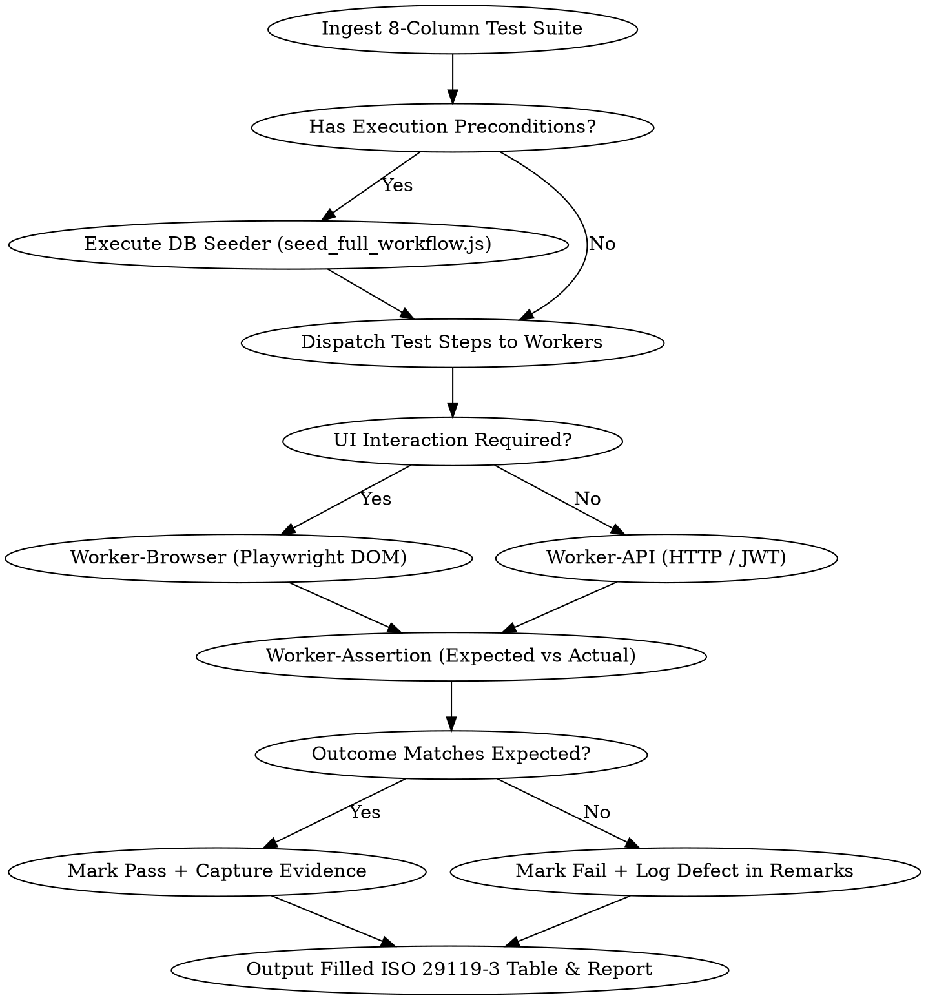

# Automated QA Tester: Multi-Agent Automated Test Execution Framework

## Overview

The `automated-qa-tester` skill bridges non-technical manual test specifications (ISO/IEC/IEEE 29119-3) and automated headless execution. It ingests 8-column test suites generated by `non-technical-test-case-generator`, coordinates headless Playwright browser automation and REST API verification, evaluates DOM and network state against expected outcomes, and automatically populates the **Actual Result**, **Pass/Fail**, and **Remarks** columns backed by observable evidence.

**The Absolute First Law of Automated QA Testing:**  
> **Zero tolerance for unverified passes or simulated outcomes.**  
> A test case is marked **Pass** ONLY when the live DOM, HTTP response, or database state strictly satisfies the documented **Expected Result**. In the presence of any selector timeout, unexpected error alert, layout crash, or mismatched status, the test MUST be marked **Fail** with actionable diagnostic traces recorded in **Remarks**.

---

## When to Use



### Triggering Situations & Symptoms
- Ingesting pending ISO/IEC/IEEE 29119-3 test cases from Markdown or Excel and automating execution against a running instance.
- Automated end-to-end (E2E) regression testing of capstone progression phases (Phase 0 Team Formation, Phase 1 Title Proposals, Phase 2–3 Manuscripts, Phase 4 Archival & Certification).
- Populating empty `[Pending Execution]` columns in audit-ready QA deliverables with verified empirical evidence.
- Verifying multi-role access controls (Student, Faculty Adviser, Committee Panelist, Committee Secretary, Course Instructor, Academic Dean) across live UI flows.
- Nightly or pre-release automated smoke testing to detect regressions before human acceptance testing.

### When NOT to Use
- Authoring brand-new plain-English manual test cases from scratch (use `non-technical-test-case-generator`).
- Low-level component unit testing or pure algorithmic unit checks (use `verification-loop` with `vitest` / `jest`).
- Static architectural audits, accessibility tree audits, or code compliance reviews without live execution (use `system-auditor`).

---

## Multi-Agent Automated QA Topology

```
┌─────────────────────────────────────────────────────────────────────────┐
│                     LEAD QA TEST ORCHESTRATOR                           │
│   Ingests Test Suites • Environment Pre-conditions • Dispatch Manager   │
└────────────────────────────────────┬────────────────────────────────────┘
                                     │
         ┌───────────────────────────┼───────────────────────────┐
         ▼                           ▼                           ▼
┌──────────────────┐        ┌──────────────────┐        ┌──────────────────┐
│  Worker-Browser  │        │    Worker-API    │        │ Worker-Assertion │
│ Playwright/DOM   │        │ REST Endpoint &  │        │ Expected vs.     │
│ UI Navigation    │        │ Payload Tester   │        │ Actual Evaluator │
└────────┬─────────┘        └────────┬─────────┘        └────────┬─────────┘
         │                           │                           │
         └───────────────────────────┼───────────────────────────┘
                                     ▼
┌─────────────────────────────────────────────────────────────────────────┐
│                       EVIDENCE & REPORTING GATE                         │
│   Captures Screenshots • Fills Actual Result / Pass/Fail • Generates Log │
└─────────────────────────────────────────────────────────────────────────┘
```

### 1. Lead QA Test Orchestrator
- **Role:** Master coordinator. Ingests test suites from Markdown files (`.md`), JSON schemas, or Excel workbooks (`.xlsx`).
- **Environment Management:** Enforces database precondition resets using `node server/seeders/seed_full_workflow.js` to ensure deterministic execution baselines.
- **Dispatching:** Decomposes test steps into UI actions for `Worker-Browser` and service checks for `Worker-API`.

### 2. Worker-Browser (Playwright DOM UI Navigation)
- **Role:** Headless browser automation agent.
- **Responsibilities:** Launches Chromium/WebKit contexts, navigates routes, inputs text with human-realistic delays, clicks buttons, toggles tabs, handles modal dialogs, and monitors console errors.
- **Strict Invariant:** Must use `waitUntil: 'domcontentloaded'` with state-based locators. **Never use `networkidle`** due to CMS-V2's real-time WebSockets and notification polling.

### 3. Worker-API (REST Endpoint & Payload Tester)
- **Role:** Direct API boundary agent.
- **Responsibilities:** Validates JWT authentication headers, checks background asynchronous workers (BullMQ queues, PaddleOCR ingestion jobs), verifies multipart file uploads, and asserts response payload structures.

### 4. Worker-Assertion (Expected vs. Actual Evaluator)
- **Role:** Impartial verification evaluator.
- **Responsibilities:** Compares observable screen states (text, banners, badges, URL paths) against the documented **Expected Result**.
- **Verdict Engine:**
  - **Pass**: Screen feedback, state changes, and URL destinations match expected conditions.
  - **Fail**: Element missing, error toast displayed, HTTP 500, or timeout exceeded.

### 5. Evidence & Reporting Gate
- **Role:** Artifact synthesizer.
- **Responsibilities:** Saves screenshot evidence to `scratch/qa-evidence/<test-id>.png`, populates the `Actual Result`, `Pass/Fail`, and `Remarks` columns, and updates the ISO 29119-3 test table in Markdown and Excel.

---

## Action Grammar: Plain-English to Playwright Translation

The execution engine translates plain-English test steps into deterministic Playwright actions using regex pattern matching:

| Plain-English Step Pattern | Playwright Automation Mapping |
| :--- | :--- |
| `1. Open [page/URL]` or `Navigate to [route]` | `await page.goto(targetUrl, { waitUntil: 'domcontentloaded' })` |
| `2. Type [value] into [field label]` | `await page.getByLabel(fieldName).fill(value)` or `page.getByPlaceholder(fieldName).fill(value)` |
| `3. Click the [button name] button` | `await page.getByRole('button', { name: buttonName }).click()` |
| `4. Select [option] from [dropdown]` | `await page.getByLabel(dropdownName).selectOption({ label: option })` |
| `5. Upload file [filename]` | `await page.setInputFiles('input[type="file"]', filePath)` |
| `6. Verify [text] is displayed` | `await expect(page.getByText(text)).toBeVisible({ timeout: 5000 })` |
| `7. Confirm [modal/dialog] appears` | `await expect(page.getByRole('dialog')).toBeVisible()` |

---

## Execution Engine CLI (`scripts/qa-test-runner.js`)

The framework is powered by the centralized execution script `scripts/qa-test-runner.js`:

```bash
# Execute full QA test suite from markdown specification
node scripts/qa-test-runner.js --suite docs/testing/BukSU_CMS_V2_Exhaustive_System_Manual_Test_Suite_ISO29119.md

# Targeted module execution (e.g. Authentication only)
node scripts/qa-test-runner.js --suite docs/testing/BukSU_CMS_V2_Exhaustive_System_Manual_Test_Suite_ISO29119.md --filter AIM

# Dry-run validation (parses test cases and validates syntax without launching browser)
node scripts/qa-test-runner.js --suite docs/testing/BukSU_CMS_V2_Exhaustive_System_Manual_Test_Suite_ISO29119.md --dry-run

# Run with automated precondition database seed
node scripts/qa-test-runner.js --suite docs/testing/BukSU_CMS_V2_Exhaustive_System_Manual_Test_Suite_ISO29119.md --seed

# Run in headed mode for visual observation
node scripts/qa-test-runner.js --suite docs/testing/BukSU_CMS_V2_Exhaustive_System_Manual_Test_Suite_ISO29119.md --headed
```

---

## Common Pitfalls & Anti-Patterns

| Anti-Pattern | Operational Hazard | Mandatory Engineering Guardrail |
| :--- | :--- | :--- |
| **Using `networkidle`** | CMS-V2's real-time notification polling (`/api/notifications`) and Socket.IO connections keep network connections open, causing Playwright to hang indefinitely. | **Strictly prohibited.** Always use `{ waitUntil: 'domcontentloaded' }` and wait for specific semantic locators (`getByRole`, `getByText`). |
| **Hardcoded `sleep()` Delays** | Introduces test flakiness, slows test runs, and causes intermittent timeouts on busy CI runners. | Use conditional state-based waiting: `await page.waitForSelector(...)` or `await expect(...).toBeVisible()`. |
| **Shared Dirty State** | Test Case 2 fails because Test Case 1 mutated team names, locked rosters, or claimed titles. | Enforce database resets before test runs (`--seed`) and use isolated persona accounts. |
| **Loose Fuzzy Assertions** | Asserting `expect(page.content()).toContain('Success')` passes even when the word appears in unrelated warning alerts. | Assert specific UI elements: `await expect(page.getByRole('alert')).toContainText('Registration successful')`. |
| **Orphaned Browser Instances** | Failed assertions crash the script before `browser.close()` runs, leaking memory and locking ports. | Wrap all execution loops in `try { ... } finally { await browser.close(); }`. |

---

## Output Verification Table (ISO/IEC/IEEE 29119-3)

Executed runs output the populated 8-column markdown table:

| Test Case # | Test Case Description | Test Steps | Test Data | Expected Result | Actual Result | Pass/Fail | Remarks |
| :--- | :--- | :--- | :--- | :--- | :--- | :---: | :--- |
| **TC-AIM-001** | Verify successful student account registration with BukSU email | 1. Open registration page.<br>2. Fill in student details.<br>3. Submit form. | Email: `maria.santos@student.buksu.edu.ph`<br>Pass: `Password123!` | Verification code sent banner displayed. | Verification code screen displayed with confirmation banner. | **Pass** | Verified via Playwright DOM selector `[role="alert"]`. |
| **TC-TFC-009** | Enforce prohibition of course instructors on defense committees | 1. Log in as instructor.<br>2. Open Assign Committee dialog.<br>3. Attempt to assign instructor. | Instructor: `Dr. Alan Turing`<br>Role: `Course Instructor` | Error banner rejects assignment. | Assignment rejected. Instructor does not appear in faculty dropdown. | **Pass** | Verified role boundary filtering in combobox. |
| **TC-PSE-005** | Enforce 25% plagiarism defense readiness threshold | 1. Open Plagiarism Report.<br>2. Verify threshold badge.<br>3. Check defense eligibility. | Score: `28.4% Similarity`<br>Threshold: `< 25%` | Non-compliant warning badge displayed. | Non-compliant warning badge displayed; defense scheduling blocked. | **Pass** | Threshold gate enforced; defense scheduling disabled. |
