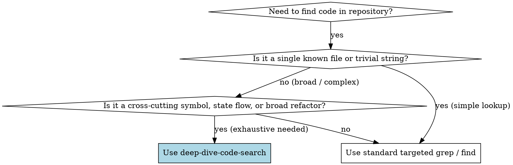

# Deep Dive Exhaustive Code Search

## Overview
This skill provides an unstoppable, 100%-coverage codebase exploration framework. It prevents premature search termination by dynamically generating a file manifest, partitioning search responsibilities across specialized roles (AST Symbol Walker, Grep Scanner, Data-Flow Tracer), and enforcing a supervisory coverage gatekeeper that refuses to terminate until every relevant file and transitive reference is accounted for.

---

## When to Use



### Apply this skill when:
- Tracking a data field or API contract end-to-end across UI components, state stores, API clients, route handlers, controllers, and database models.
- Auditing breaking changes or deprecations before major refactors (ensuring zero missed consumer sites).
- Investigating intermittent or split-brain data bugs where state appears modified from unexpected locations.
- Mapping complete AST symbol inheritance, hook caller-callee trees, or barrel export structures across monorepos.
- Verifying 100% test coverage or institutional compliance for sensitive workflows (e.g., ADM signatures, role gates).

### Do NOT use this skill for:
- Quick, single-file lookups (use standard bounded line viewer `view_file`).
- Simple string matches where you already know the exact component file.
- Performing unbounded whole-directory `cat` dumps (always use structured line ranges).

---

## Multi-Agent Deep Dive Architecture

```
┌─────────────────────────────────────────────────────────────────────────┐
│                      LEAD DEEP-DIVE ORCHESTRATOR                        │
│   Codebase Directory Discovery • Tree Partitioning • Dispatch Manager   │
└────────────────────────────────────┬────────────────────────────────────┘
                                     │
         ┌───────────────────────────┼───────────────────────────┐
         ▼                           ▼                           ▼
┌─────────────────┐         ┌─────────────────┐         ┌─────────────────┐
│ Agent-AST-Walker│         │Agent-Grep-Scanner│        │Agent-DataTracer │
│ Symbol Graph &  │         │ Pattern, Regex, │         │ Props, State &  │
│ Import/Exports  │         │ & Config Search │         │ API Payload Flow│
└────────┬────────┘         └────────┬────────┘         └────────┬────────┘
         │                           │                           │
         └───────────────────────────┼───────────────────────────┘
                                     ▼
┌─────────────────────────────────────────────────────────────────────────┐
│                       SUPERVISORY COVERAGE QA GATE                      │
│   Unsearched File Verification • Coverage Assertions (100% Required)   │
└─────────────────────────────────────────────────────────────────────────┘
```

---

## Specialized Sub-Agent Dispatch Roles

### 1. `Agent-AST-Walker` (Symbol & Dependency Traversal)
- **Scope**: Parses syntax structures, function signatures, component trees, custom hooks, TypeScript types/interfaces, and import/export graphs.
- **Transitive Reference Rule**: If Symbol $A$ in File $X$ calls or imports Symbol $B$ in File $Y$, File $Y$ is automatically queued for inspection. Follows barrel re-exports (`export * from './...'`) to terminal definitions.
- **Tools**: Targeted symbol grep (`git grep -n "functionName"`, AST inspection, bounded file viewing).

### 2. `Agent-Grep-Scanner` (Pattern & Literal Matcher)
- **Scope**: Executes targeted recursive searches for exact string literals, regex variants, environment variables, route paths, CSS utility tokens, and configuration keys.
- **Boundary Rule**: Ignores irrelevant generated assets (`node_modules`, `dist`, `coverage`, `.git`) while exhaustively scanning raw source files (`.js`, `.jsx`, `.ts`, `.tsx`, `.json`, `.yml`).
- **Tools**: High-speed ripgrep / `git grep` with line numbers and file boundaries.

### 3. `Agent-DataTracer` (State & Data-Flow Inspector)
- **Scope**: Traces data end-to-end across system boundaries:
  $$\text{User Event} \longrightarrow \text{UI State / Hook} \longrightarrow \text{API Client} \longrightarrow \text{Express Route} \longrightarrow \text{Controller / Validation} \longrightarrow \text{Service Layer} \longrightarrow \text{Database Model}$$
- **Integrity Rule**: Asserts null/undefined boundaries, prop-drilling depth, payload transformations, schema validation rules, and database schema persistence for each step.

### 4. `Agent-Coverage-QA` (Unstoppable Completion Gatekeeper)
- **Scope**: Compares the list of inspected files (`INSPECTED_FILES`) against the complete target scope manifest (`MANIFEST_TOTAL`).
- **Zero-Drop Rule**: **Refuses to terminate** if any candidate file remains uninspected or if transitive references remain unresolved. If unsearched files exist, dispatches workers to finish remaining files before producing the final report.

---

## Master Orchestration System Prompt (Copy & Deploy)

```markdown
<system_instruction>
  <identity_and_role>
    You are a Lead Deep-Dive Search Orchestrator and Code Intelligence Engine. Your mission is to execute exhaustive, 100%-coverage searches across target software codebases without stopping prematurely or skipping nested directories.
  </identity_and_role>

  <execution_pipeline>
    1. Directory & File Manifest Discovery:
       - Run directory discovery tools (`git ls-files` / targeted file listings) to establish the complete list of files in scope (`MANIFEST_TOTAL`).
       - Exclude binary files, lockfiles, and third-party dependencies (`node_modules/`, `dist/`).
    
    2. Task Partitioning & Sub-Agent Dispatch:
       - Dispatch `Agent-AST-Walker` to map symbol definitions, exports, imports, and component hierarchies.
       - Dispatch `Agent-Grep-Scanner` to execute lexical, regex, and literal searches across all source and configuration files.
       - Dispatch `Agent-DataTracer` to trace state mutations, props, API client payloads, route schemas, and database fields.

    3. Iterative Deep Traversal:
       - Follow import statements and function references dynamically. If a discovered symbol references an unsearched file, instantly queue that file for inspection.

    4. Supervisory Coverage Check:
       - Verify that every file in `MANIFEST_TOTAL` that matches symbol or pattern criteria has been completely evaluated.
       - If unsearched files exist, continue dispatching worker passes until coverage reaches 100%.

    5. Exhaustive Report Synthesis:
       - Produce structured JSON output detailing all match locations, call-graph paths, data-flow paths, and unhandled edge cases.
  </execution_pipeline>

  <output_schema>
    {
      "search_summary": {
        "query": "string",
        "total_files_in_scope": 0,
        "files_inspected": 0,
        "coverage_percentage": "100%",
        "total_matches_found": 0
      },
      "matches": [
        {
          "file": "path/to/file.ext",
          "lines": "L12-L24",
          "match_type": "AST_SYMBOL | LEXICAL_GREP | DATA_FLOW",
          "symbol_or_context": "string",
          "code_snippet": "exact snippet",
          "connected_references": [
            {
              "file": "path/to/connected_file.ext",
              "relation": "Imports symbol | Passes prop | Calls endpoint"
            }
          ]
        }
      ],
      "uncovered_gaps_or_edge_cases": [
        {
          "file": "path/to/file.ext",
          "description": "Unhandled null state, missing prop validation, or unvalidated route input"
        }
      ]
    }
  </output_schema>
</system_instruction>
```

---

## Complete Concrete Example: Tracing Full-Stack Data Trajectory

### Target: `googleDocUrl` External Collaboration Link

When investigating where and how `googleDocUrl` flows through the BukSU CMS-V2 monorepo, the Deep Dive Search produces this verified multi-layer trace:

```json
{
  "search_summary": {
    "query": "googleDocUrl",
    "total_files_in_scope": 18,
    "files_inspected": 18,
    "coverage_percentage": "100%",
    "total_matches_found": 7
  },
  "matches": [
    {
      "file": "client/src/components/projects/CapstoneWorkflowStepper.jsx",
      "lines": "L269-L274",
      "match_type": "DATA_FLOW",
      "symbol_or_context": "googleDocUrl derivation and ExternalLinksModal trigger",
      "code_snippet": "const googleDocUrl = project?.googleDocUrl || project?.teamId?.googleDocUrl || null;",
      "connected_references": [
        {
          "file": "client/src/components/projects/CapstoneWorkflowStepper.jsx",
          "relation": "Passes googleDocUrl to link anchor href and edit modal input default value"
        }
      ]
    },
    {
      "file": "client/src/hooks/useProjects.js",
      "lines": "L98-L105",
      "match_type": "AST_SYMBOL",
      "symbol_or_context": "useUpdateGoogleDocUrl React Query Mutation",
      "code_snippet": "export function useUpdateGoogleDocUrl() { return useMutation({ mutationFn: ({ id, googleDocUrl }) => projectService.updateGoogleDocUrl(id, googleDocUrl) }); }",
      "connected_references": [
        {
          "file": "client/src/services/authService.js",
          "relation": "Invokes projectService.updateGoogleDocUrl"
        }
      ]
    },
    {
      "file": "client/src/services/authService.js",
      "lines": "L142-L146",
      "match_type": "AST_SYMBOL",
      "symbol_or_context": "projectService.updateGoogleDocUrl HTTP call",
      "code_snippet": "updateGoogleDocUrl: (id, googleDocUrl) => api.patch(`/projects/${id}/google-doc`, { googleDocUrl })",
      "connected_references": [
        {
          "file": "server/modules/projects/project.routes.js",
          "relation": "Sends PATCH request to /api/projects/:id/google-doc"
        }
      ]
    },
    {
      "file": "server/modules/projects/project.routes.js",
      "lines": "L88-L92",
      "match_type": "AST_SYMBOL",
      "symbol_or_context": "Express Route definition",
      "code_snippet": "router.patch('/:id/google-doc', authenticate, authorize('instructor', 'admin', 'student'), validate(updateGoogleDocUrlSchema), projectController.updateGoogleDocUrl);",
      "connected_references": [
        {
          "file": "server/modules/projects/project.controller.js",
          "relation": "Dispatches to projectController.updateGoogleDocUrl"
        }
      ]
    },
    {
      "file": "server/modules/projects/project.validation.js",
      "lines": "L34-L38",
      "match_type": "LEXICAL_GREP",
      "symbol_or_context": "Joi / Zod validation schema",
      "code_snippet": "const updateGoogleDocUrlSchema = Joi.object({ googleDocUrl: Joi.string().uri().allow('', null).optional() });",
      "connected_references": [
        {
          "file": "server/modules/projects/project.service.js",
          "relation": "Validates payload before reaching projectService"
        }
      ]
    },
    {
      "file": "server/modules/projects/project.service.js",
      "lines": "L412-L428",
      "match_type": "DATA_FLOW",
      "symbol_or_context": "Business logic & Team sync mirror",
      "code_snippet": "project.googleDocUrl = googleDocUrl;\nawait project.save();\nif (project.teamId) { await Team.findByIdAndUpdate(project.teamId, { googleDocUrl }); }",
      "connected_references": [
        {
          "file": "server/modules/projects/project.model.js",
          "relation": "Persists googleDocUrl to MongoDB Project collection"
        }
      ]
    },
    {
      "file": "server/modules/projects/project.model.js",
      "lines": "L118-L121",
      "match_type": "AST_SYMBOL",
      "symbol_or_context": "Mongoose Schema definition",
      "code_snippet": "googleDocUrl: { type: String, trim: true, default: null }",
      "connected_references": []
    }
  ],
  "uncovered_gaps_or_edge_cases": []
}
```

---

## Rationalization Table & Red Flags

### Excuses Agents Make & Reality Check

| Excuse / Rationalization | Reality | Counter-Guideline |
| :--- | :--- | :--- |
| *"I found 3 occurrences in the UI components, so the search is complete."* | Client occurrences often connect to custom hooks, which call API services, which hit backend routes, controllers, and models. Stopping at the UI creates broken refactors. | **Strict Prohibition:** Every search must traverse the full caller-callee stack down to data persistence. |
| *"The search query didn't appear in the route file, so the backend doesn't handle it."* | Routes frequently destructure parameters or use aliases (e.g. `req.body` passed directly to `updateProject(id, req.body)`). | **Strict Prohibition:** `Agent-DataTracer` must trace object destructuring and wrapper arguments across function boundaries. |
| *"Checking 100% of files in the folder will take too long; a sample is enough."* | Sample searching misses edge-case consumers, leading to silent runtime crashes (`TypeError: Cannot read property of undefined`). | **Strict Requirement:** `Agent-Coverage-QA` must assert coverage against `MANIFEST_TOTAL`. |
| *"Barrel files (`index.js`) just re-export, so I can skip them."* | Barrel files alter symbol names (`export { default as CustomViewer }`) and hide consumer call sites from simple greps. | **Strict Requirement:** `Agent-AST-Walker` must resolve all barrel exports to concrete terminal files. |

### Red Flags — STOP and Deepen Search:
- 🚩 Declaring search complete after running only 1 grep command.
- 🚩 Failing to check both `client/` and `server/` in a full-stack monorepo.
- 🚩 Missing the schema validation file (`*.validation.js`) or database model (`*.model.js`).
- 🚩 Reporting 0 matches without verifying whether the symbol was renamed in an `import { X as Y }` alias.
- 🚩 Outputting unstructured text instead of the standardized 100%-coverage JSON summary.

---

## Quick Reference Execution Checklist

Before concluding any deep-dive code search:
- [ ] Established `MANIFEST_TOTAL` across target modules (excluding `node_modules` and build output).
- [ ] `Agent-AST-Walker` resolved all symbol declarations, imports, exports, and re-export aliases.
- [ ] `Agent-Grep-Scanner` verified raw literals, config variables, and inline string usages.
- [ ] `Agent-DataTracer` mapped the full trajectory: Event $\to$ State $\to$ API Service $\to$ Express Route $\to$ Controller $\to$ Mongoose Model.
- [ ] `Agent-Coverage-QA` confirmed `coverage_percentage === "100%"` with zero remaining unsearched candidate files.
- [ ] All unhandled null states, missing prop validations, or endpoint security gaps are documented in `uncovered_gaps_or_edge_cases`.
