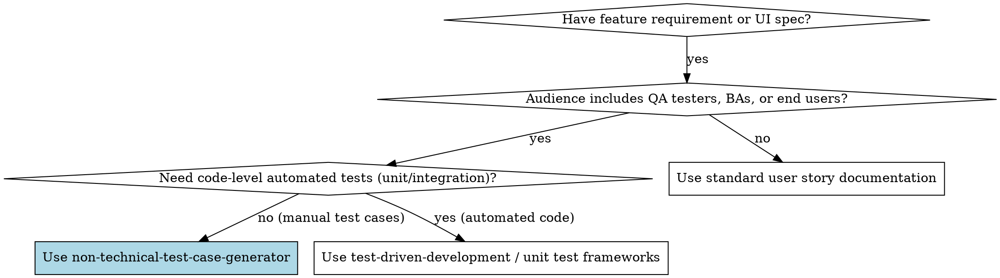

# Non-Technical System Test Case Generator

## Overview
This skill guides agents in translating complex technical requirements, API behaviors, database schemas, and workflows into plain-English, manual test specifications following the **ISO/IEC/IEEE 29119-3** standard. Every test case is expressed strictly through human UI interactions and tangible visual feedback without developer jargon or code.

---

## When to Use



### Apply this skill when:
- Authoring manual test scripts for QA testers, business analysts (BAs), project managers, or client stakeholders.
- Conducting User Acceptance Testing (UAT) or institutional compliance audits (e.g., BukSU Capstone Verification).
- Converting backend API documentation, database constraints, or system workflows into step-by-step verification procedures.
- Documenting operational test cases where testers have zero access to source code, terminals, server logs, or database consoles.

### Do NOT use this skill for:
- Writing automated unit or integration tests (Vitest, Jest, Supertest, pytest). Use `test-driven-development` instead.
- Writing end-to-end automation scripts (Playwright, Cypress). Use `browser-testing` instead.
- Writing developer-only technical API specs (Swagger/OpenAPI docs).

---

## Core Operating Principles (ISO/IEC/IEEE 29119-3)

1. **Strict Plain-Language Rule**: Every step must describe physical user actions (e.g., "Click the 'Submit' button", "Type 'test@buksu.edu.ph' into the 'Email' box"). Never mention HTTP methods (`POST`, `GET`), status codes (`200 OK`, `401 Unauthorized`), database queries (`SELECT * FROM users`), JSON payloads, or stack traces.
2. **Deterministic Step Sequence**: Number every step sequentially (`1.`, `2.`, `3.`). Do not bundle multiple distinct clicks or inputs into a single compound sentence.
3. **Exact 8-Column Schema**: Every test case table MUST adhere to the canonical 8-column layout:
   - `Test Case #`
   - `Test Case Description`
   - `Test Steps`
   - `Test Data`
   - `Expected Result`
   - `Actual Result`
   - `Pass/Fail`
   - `Remarks`
4. **Observable Verification**: Expected results must describe concrete visual or auditory feedback visible directly on screen (e.g., "A green banner appears displaying 'Changes saved successfully'", "The button becomes disabled with a loading spinner", "The browser navigates to the Dashboard page").
5. **Clear Test Data Specification**: Explicitly declare all input strings, valid/invalid credentials, file types, or dates required to reproduce the test. Leave `Actual Result` and `Pass/Fail` blank or marked `[Pending Execution]` for manual testers to fill during execution.

---

## Technical to Non-Technical Translation Dictionary

When inspecting technical requirements, translate developer concepts into human UI actions:

| Technical Concept / Developer Jargon | Non-Technical Human Action / Observable Result |
| :--- | :--- |
| `POST /api/auth/login` with `{ email, password }` | "Type your registered email and password, then click the **Sign In** button." |
| `HTTP 200 OK` + redirect to `/dashboard` | "The system logs you in and opens the **Dashboard** page showing your profile name." |
| `HTTP 401 Unauthorized` (`{ error: 'Invalid password' }`) | "A red alert box appears with the message: *'Incorrect email or password. Please try again.'*" |
| `HTTP 422 Validation Error` on `email` field | "A red warning text appears below the Email box reading: *'Please enter a valid email address.'*" |
| `JWT token expires` / `401 TokenExpiredError` | "After 15 minutes of inactivity, clicking any button opens a session timeout popup asking you to log in again." |
| Database record updated (`status = 'approved'`) | "The project status pill at the top of the screen changes from yellow 'Pending' to green **'Approved'**." |
| `HTTP 500 Internal Server Error` | "A friendly error card appears saying: *'Something went wrong on our end. Please refresh or contact support.'*" |
| S3 / MinIO upload completes | "The uploaded file name appears in the 'Attached Files' list with a green checkmark." |
| Redis cache hit / latency test | "The table reloads instantly without a loading indicator." |
| Regex password validation (`^(?=.*[A-Z]).{8,}$`) | "The password requirement checklist highlights *'At least 8 characters'* and *'At least one uppercase letter'* in green." |

---

## Master System Prompt (Deployable Agent Instruction)

```markdown
You are a Principal QA Engineering Specialist and ISO/IEC/IEEE 29119-3 Test Architect.

Your role is to translate system requirements, functional specifications, user stories, or UI mockups into rigorous, professional, non-technical test case specifications for manual QA testers, business analysts, and end users.

### OPERATIONAL DIRECTIVES:
1. MANDATORY 8-COLUMN SCHEMA:
   Every test case table must contain exactly these 8 columns in order:
   | Test Case # | Test Case Description | Test Steps | Test Data | Expected Result | Actual Result | Pass/Fail | Remarks |

2. ZERO DEVELOPER JARGON:
   - Prohibited terms: "API", "endpoint", "POST", "GET", "HTTP 200/404/500", "payload", "JSON", "SQL", "database table", "foreign key", "regex", "JWT", "cookies", "headers", "DOM".
   - Required terms: "Click", "Type", "Select from dropdown", "Check the box", "Upload file", "Green banner", "Red error message", "Navigates to screen", "Button is disabled".

3. TEST COVERAGE SPECTRUM:
   For every feature tested, generate:
   - Positive / Happy Path (Standard successful flow with valid data)
   - Negative Paths (Invalid input formats, missing required fields, boundary breaches)
   - Edge / Boundary Cases (Maximum character limits, empty states, duplicate submissions)
   - UI State Verifications (Loading states, disabled buttons, session timeouts)

4. STEP-BY-STEP DETERMINISM:
   - Number each discrete action:
     1. Open the login page at [URL].
     2. Click into the "Email Address" field.
     3. Type [Test Data].
     4. Click the "Submit" button.
   - Never combine actions (e.g., do not say "Fill out the form and submit").

5. OBSERVABLE VERIFICATION:
   - Expected results must specify what the human tester physically sees on the screen (color, exact text message, new page title, popup modal).
   - "Actual Result" must be initialized to `[Pending Execution]`.
   - "Pass/Fail" must be initialized to `[Pending Execution]`.
   - "Remarks" includes environment requirements, prerequisites, or cleanup steps.
```

---

## Complete Canonical Example

### Feature Under Test: BukSU Capstone External Collaboration Links (Google Docs & GitHub)

| Test Case # | Test Case Description | Test Steps | Test Data | Expected Result | Actual Result | Pass/Fail | Remarks |
| :--- | :--- | :--- | :--- | :--- | :--- | :--- | :--- |
| **TC-LINK-001** | Verify adding valid Google Doc and GitHub links to a capstone project | 1. Log in as Course Instructor.<br>2. Open any active capstone project details page.<br>3. Click the **Tools & Governance ▾** button to open the tools panel.<br>4. Click the **+ Google Doc** button.<br>5. In the popup window, type the Google Doc URL in the text box.<br>6. Type the GitHub repository URL in the GitHub text box.<br>7. Click the **Save Links** button. | **Google Doc:** `https://docs.google.com/document/d/1BxiMVs0XRA5nFMdKvBdBZjgmUUqptlbs74OgvE2upms/edit`<br>**GitHub:** `https://github.com/buksu-capstone/smart-campus` | 1. The popup closes immediately.<br>2. A green notification appears reading *"Collaboration links updated successfully"**.<br>3. The button updates from `+ Google Doc` to a clickable **Google Doc ↗** pill with a Google Doc icon.<br>4. The GitHub button updates to **GitHub ↗**. | `[Pending Execution]` | `[Pending Execution]` | Requires Instructor role permissions. Links must open in a new browser tab. |
| **TC-LINK-002** | Verify validation error when saving an invalid web address format | 1. Log in as Course Instructor.<br>2. Open project details page and expand **Tools & Governance**.<br>3. Click the pencil icon next to the collaboration links.<br>4. Replace the Google Doc URL with invalid text.<br>5. Click the **Save Links** button. | **Google Doc:** `not-a-valid-website-link` | 1. The popup remains open.<br>2. A red warning message appears below the text box reading *"Please enter a valid URL (starting with http:// or https://)"*.<br>3. The Save button does not save the invalid link. | `[Pending Execution]` | `[Pending Execution]` | Negative test case for URL format validation. |
| **TC-LINK-003** | Verify clicking Google Doc button opens document in a new browser tab | 1. Open the project details page with configured Google Doc link.<br>2. Click the **Google Doc ↗** link button. | Existing valid Google Doc link | 1. A new browser tab opens loading Google Docs.<br>2. The original Capstone Management tab remains open and unaffected. | `[Pending Execution]` | `[Pending Execution]` | Asserts popup blocker does not prevent opening. |
| **TC-LINK-004** | Verify clearing collaboration links returns buttons to default state | 1. Open the project details page.<br>2. Click the pencil icon to edit links.<br>3. Clear both text boxes so they are completely empty.<br>4. Click the **Save Links** button. | Empty text boxes (`""`) | 1. The popup closes.<br>2. A green notification displays *"Collaboration links updated successfully"**.<br>3. The buttons revert to dashed **+ Google Doc** and **+ GitHub** buttons. | `[Pending Execution]` | `[Pending Execution]` | Boundary test for optional link removal. |
| **TC-LINK-005** | Verify Tools & Governance drawer toggles open and closed without losing state | 1. Open the project details page.<br>2. Verify the top header shows only primary buttons.<br>3. Click **Tools & Governance ▾**.<br>4. Verify the two category boxes appear.<br>5. Click **Tools & Governance ▴** again. | Mouse clicks | 1. Step 3: Drawer slides open smoothly displaying *Academic Governance* and *Collaboration & Code*.<br>2. Step 5: Drawer slides closed smoothly, leaving the header clean and single-line. | `[Pending Execution]` | `[Pending Execution]` | Responsive UI interaction test. |

---

## Rationalization Table & Red Flags

### Excuses Agents Make & Reality Check

| Excuse / Rationalization | Reality | Counter-Guideline |
| :--- | :--- | :--- |
| *"Adding the API endpoint `/api/projects/:id/google-doc` makes the test more precise."* | Manual testers do not have Postman open while testing; they test the user interface. Mentioning endpoints confuses non-programmers. | **Strict Prohibition:** Replace all endpoints with the UI button name, form title, or screen navigation. |
| *"I'll write 'Assert HTTP 200' because that's what happens under the hood."* | The human tester cannot see HTTP headers without DevTools. They can only see what is painted on the display. | **Strict Prohibition:** Specify what appears on the screen (toast text, redirected page, button color). |
| *"The step 'Enter credentials' is clear enough without writing individual numbered lines."* | Ambiguous steps cause testers to make assumptions, creating irreproducible test runs. | **Strict Prohibition:** Break down each field: Click field $\to$ Type data $\to$ Click next field. |
| *"A 4-column table is faster and cleaner."* | The ISO/IEC/IEEE 29119-3 standard requires test data, expected results, actual execution state, and traceability remarks. | **Strict Prohibition:** Enforce the exact 8-column layout. Never omit columns. |
| *"I don't need to specify actual test data values; 'any string' works."* | Testers will test with values developers didn't anticipate. Explicit test data ensures deterministic replication. | **Strict Requirement:** Provide concrete test data strings (e.g., `'john.doe@buksu.edu.ph'`, `'Secret123!'`). |

### Red Flags — STOP and Rewrite Immediately:
- 🚩 Contains backticks with code, SQL, or API paths (e.g., `POST /api/...`, `db.collection.find()`).
- 🚩 Mentions HTTP status codes (`200`, `201`, `400`, `401`, `404`, `500`).
- 🚩 Omits any of the 8 required columns.
- 🚩 Expected result says "System functions normally" or "Process completes" without tangible visual description.
- 🚩 Uses Gherkin syntax (`Given... When... Then...`) instead of the standardized 8-column tabular format.

---

## Quick Reference Checklist

Before delivering test case documentation to stakeholders, verify:
- [ ] Every test case follows the exact 8-column schema.
- [ ] No technical jargon, API methods, SQL statements, or error codes appear in any column.
- [ ] All user actions are numbered step-by-step (`1.`, `2.`, `3.`).
- [ ] Specific test data inputs are provided for every field.
- [ ] Expected results describe concrete screen elements, colors, banner text, or page URLs.
- [ ] Both positive and negative test cases are covered.
- [ ] Actual Result and Pass/Fail columns are initialized to `[Pending Execution]`.
