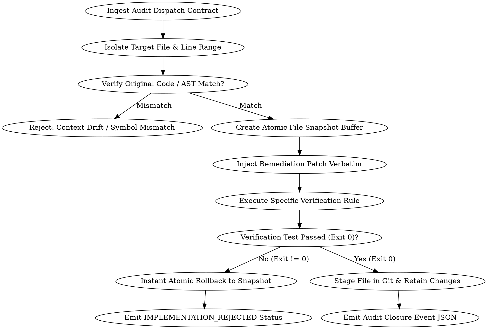

# System Implementor Skill: Verbatim & Zero-Drift Patch Execution Framework

## Overview

The `system-implementor` skill serves as the exact execution counterpart to `system-auditor` and the 19 Impeccable skills (`i-harden`, `i-arrange`, `i-typeset`, `i-clarify`, `i-optimize`, etc.). It guarantees that audit-recommended remediations and dispatch contracts are applied **word-for-word and line-for-line** without creative drift, unprompted refactoring, or collateral damage.

**The Absolute First Law of System Implementation:**  
> **Zero Creative Distortion & Atomic Test-Gated Rollback.**  
> An implementor is a deterministic execution engine, not a creative refactorer. It modifies ONLY the target AST nodes and line ranges specified in the audit contract. If post-patch compilation, linting, or verification rules fail, the change is instantly rolled back to the pre-change baseline snapshot and emitted as `IMPLEMENTATION_REJECTED / ROLLBACK`.

---

## When to Use

### Triggering Situations & Symptoms
- Ingesting structured audit findings and dispatch contracts from `system-auditor` or `i-audit`
- Applying specific Impeccable sub-agent remediations (`i-harden`, `i-clarify`, `i-arrange`, `i-typeset`, `i-normalize`, `i-optimize`)
- Executing automated codebase remediation loops via `npm run audit:fix`
- Applying high-consequence security patches (OWASP, CVEs, broken access control) where blast radius must be strictly isolated
- Applying compliance fixes where surrounding code must remain 100% frozen

### When NOT to Use
- Exploratory greenfield feature development or prototyping (use `brainstorming` or `implementer`)
- Broad architectural redesigns requiring multi-file structural shifts (use `writing-plans` and `executing-plans`)
- Refactoring whole modules for code aesthetics or style preferences (use `refactor`)

---

## Core Operating Principles

1. **Zero Creative Distortion**: Treat the auditor's `remediation_patch` or `remediation_code_block` as deterministic instructions. Modify ONLY the target lines specified in the finding and leave surrounding logic, formatting, and variable names untouched.
2. **AST Line-Range Alignment**: Verify that the code at the target `line_range` matches the `original_code_snippet` before applying edits. If code has shifted due to prior edits, use AST symbol matching to pinpoint the exact node rather than guessing lines.
3. **Atomic Patch Execution & Rollback**: Save snapshot backups before patching. If post-patch compilation, linting, or verification fails (`exit_code !== 0`), trigger an immediate rollback to the snapshot and flag the finding as `IMPLEMENTATION_REJECTED / ROLLBACK`.
4. **Verbatim Verification Gate**: Execute the exact `verification_rule` specified in the contract (e.g., `npm run test:a11y`, `npx tsc --noEmit`, or targeted Vitest suite). Confirm the defect is 100% eliminated before marking the contract resolved.

---

## Execution Flowchart



---

## Ingestion Schema (Input Contract)

The implementor skill accepts standardized dispatch contracts emitted by `system-auditor`:

```json
{
  "contract_id": "IMPL-DISPATCH-001",
  "audit_finding_id": "AUDIT-SEC-003",
  "target_file": "server/modules/submissions/submission.service.js",
  "line_range": {
    "start_line": 42,
    "end_line": 46
  },
  "original_code_snippet": "const query = `SELECT * FROM submissions WHERE project_id = '${projectId}'`;\nconst result = await db.query(query);",
  "remediation_patch": "const query = 'SELECT * FROM submissions WHERE project_id = $1';\nconst result = await db.query(query, [projectId]);",
  "verification_rule": "npm run test:server -- tests/unit/submission.service.test.js",
  "assigned_impeccable_skill": "i-harden"
}
```

---

## Step-by-Step Implementation Pipeline

### Phase 1: Context Isolation & Originality Match
1. Open `target_file` using bounded line inspection (`view_file`).
2. Read the lines surrounding `line_range.start_line` to `line_range.end_line`.
3. Perform a strict string & AST equivalence check between the code present in the file and `original_code_snippet`.
   - *If Match*: Proceed to Phase 2.
   - *If Mismatch (Drift)*: Locate the symbol by name (function, component, hook) and match the exact syntax structure. If the node cannot be matched with 100% certainty, abort with status `REJECTED_CONTEXT_DRIFT`.

### Phase 2: Verbatim Patch Injection
1. Create a snapshot backup of the original file state in temporary memory or `.audit-snapshots/`.
2. Apply `remediation_patch` replacing `original_code_snippet` word-for-word and line-for-line via surgical CST replacement (`replace_file_content`).
3. Maintain project-level formatting conventions without modifying the logic of the patch.
4. Save the updated file.

### Phase 3: Post-Implementation Verification Gate
1. Execute the command specified in `verification_rule` (e.g., targeted unit test, `npm run check:endpoints`, or linting command).
2. Inspect `stdout`, `stderr`, and `exit_code`.
3. **Rollback Condition**:
   - If `exit_code !== 0` or new compiler/runtime errors are detected:
     - Immediately restore `target_file` from the pre-patch snapshot.
     - Emit status `IMPLEMENTATION_REJECTED / ROLLBACK`.
     - Record the failure log in the audit remediation report.
   - If `exit_code === 0`:
     - Keep the changes and proceed to Phase 4.

### Phase 4: Audit Closure Event
Emit the final implementation payload back to `i-audit` and the `i-critique` Supervisory Gatekeeper:

```json
{
  "implementation_status": "SUCCESS | ROLLBACK | BLOCKED",
  "contract_id": "IMPL-DISPATCH-001",
  "audit_finding_id": "AUDIT-SEC-003",
  "target_file": "server/modules/submissions/submission.service.js",
  "lines_modified": "L42-L46",
  "diff_summary": "- const query = `SELECT * FROM submissions WHERE project_id = '${projectId}'`;\n+ const query = 'SELECT * FROM submissions WHERE project_id = $1';\n+ const result = await db.query(query, [projectId]);",
  "verification_result": {
    "command": "npm run test:server -- tests/unit/submission.service.test.js",
    "exit_code": 0,
    "output_summary": "1 test suite passed (14/14 tests passing)"
  }
}
```

---

## Sub-Agent Dispatch Integration Rules

When executing contracts assigned from specific Impeccable skills:

* **For `i-harden`**: Inject the exact error boundaries, null coalescing checks, parameter sanitization, and focus-lock containers verbatim. Do NOT modify surrounding business logic or external call signatures.
* **For `i-clarify`**: Replace error strings, microcopy, form field labels, and button text with the exact strings provided in the contract. Do NOT restructure surrounding JSX elements or state hooks.
* **For `i-arrange` & `i-typeset`**: Apply the exact CSS utility classes (Tailwind tokens or typography variables) specified in the remediation diff. Do NOT re-order unmentioned components or modify unrelated container props.
* **For `i-normalize` & `i-extract`**: Replace hardcoded values with the exact design system tokens (`bg-background`, `text-foreground`, `border-border/60`).
* **For `i-optimize`**: Inject memoization (`useMemo`, `useCallback`), virtualization windowing, or query projection limits verbatim without changing return shapes.
* **For `i-quieter`**: Attenuate saturated background fills, remove aggressive animations, and inject `motion-reduce:animate-none` guards verbatim.

---

## Rationalization Table & Counter-Rules

| Excuse / Temptation | Reality & Counter-Rule |
|---|---|
| "While I'm touching this file, I might as well clean up and modernize this other function." | **Strict scope containment.** Opportunistic refactoring pollutes audit trails, obscures git blame, and expands the blast radius. Modify ONLY the target lines in the contract. |
| "Renaming variables to camelCase or more descriptive names makes the code cleaner." | **Zero creative distortion.** Renaming variables breaks downstream callers, test assertion mocks, and external contracts. Keep all existing identifier names intact. |
| "The verification test failed with exit code 1, but the SQL/CSS fix is obviously correct, so I'll keep the changes." | **Zero-tolerance verification gates.** An exit code of 1 is a hard failure. Passing code visually does not override failing test suites. Instantly roll back to baseline snapshot. |
| "Rolling back on test failure wastes time; I can just fix the test mock instead." | **Implementor boundary constraint.** The implementor's mandate is to execute the patch, not rewrite test suites to mask runtime mismatches. Roll back and report `REJECTED_VERIFICATION_FAILURE`. |
| "The line numbers shifted slightly, so I'll guess where the code is." | **AST symbol matching is required.** Never guess shifted line numbers. Match the exact function, hook, or component symbol node before applying changes. |
| "I don't need to create a snapshot backup because git tracks changes anyway." | **Atomic transactions require local snapshot buffers.** A local backup buffer guarantees instantaneous, reliable rollback without dirtying the git staging index or dropping unstaged developer work. |

---

## Red Flags - STOP and Roll Back

- Modifying any lines outside the specified contract line range
- Renaming existing variables, parameters, or exported types
- Keeping file changes after a verification test exits with code != 0
- Guessing shifted line numbers without AST symbol equivalence confirmation
- Skipping the execution of `verification_rule`
- Failing to produce the structured Audit Closure Event JSON report

---

## Common Mistakes & Anti-Patterns

1. **Opportunistic Refactoring**: Cleaning up formatting, converting callbacks to async/await, or fixing unrelated typos in the target file.
2. **Hope-Driven Retention**: Leaving broken code committed because "the patch logic is obviously right and the test must be flaky".
3. **Variable Renaming**: Renaming `data` to `resultData` or `item` to `rowItem` during patch application.
4. **Context Drift Blindness**: Applying a diff to lines that have already been shifted by a previous patch without checking AST node equivalence.
5. **Missing Verification Execution**: Assuming that if the file saved without syntax error, the verification passed. Always run the actual verification command and assert `exit_code === 0`.
