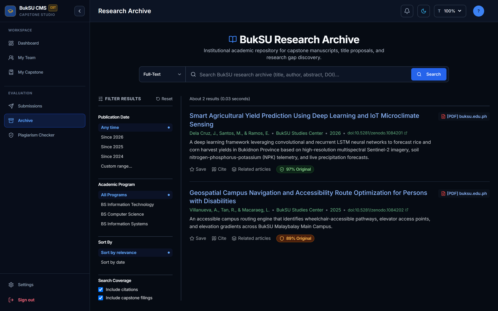
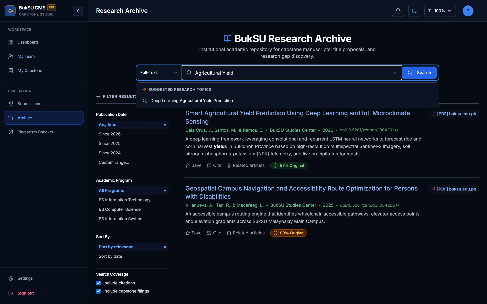
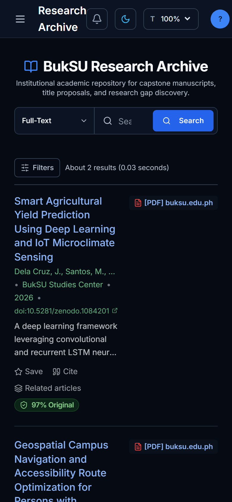
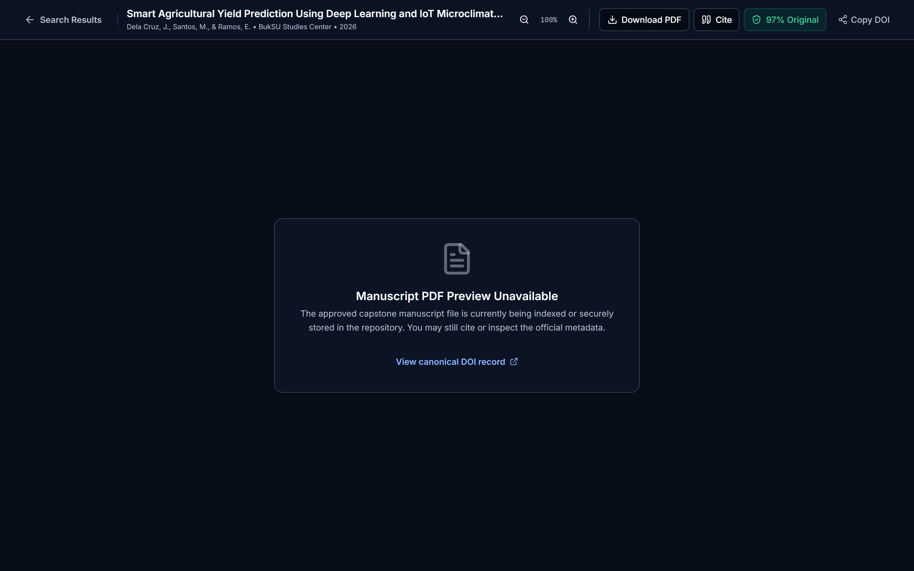
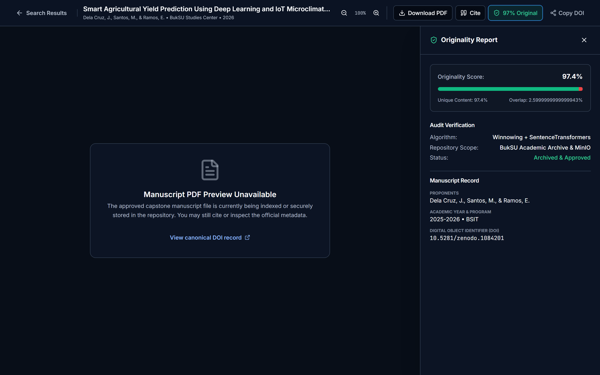

# BukSU Research Archive Search Normalization & Dedicated Document Viewer

**Target Platform:** BukSU Capstone Management System V2 (CMS-V2)  
**Compliance Standard:** ASDLC [v2.0] & Supreme Cognitive Protocols [v2.1]  
**Component Scope:** `client/src/components/archive/`, `client/src/pages/archive/`, `client/src/hooks/useArchiveSearchState.js`  
**Status:** Implemented, Verified & Fully Audited  

---

## 1. Executive Summary

This document records the architectural decisions, accessibility contracts, state synchronization models, and verification evidence for two interconnected enhancements to the BukSU Research Archive (`/archive`):

1. **Search Input Normalization & Dual "X" Elimination**: Explicit neutralization of browser-native WebKit search cancel buttons, resolved collisions with a single custom state-managed clear button, and completed the full WAI-ARIA 1.2 Combobox contract with live region announcements.
2. **Dedicated Route Document Viewer Architecture (`/archive/document/:projectId`)**: Transitioned document reading from an inline split-canvas to a full-viewport URL-addressable route. Engineered `CanonicalDocumentViewer` with a consolidated 5-action toolbar stripped of drafting/revision diff tools, backed by URL parameter synchronization (`useArchiveSearchState`) with debounced history replacement, facet-preserving query clearance, and bounded LRU scroll restoration.

---

## 2. Problem Statement & Architectural Root Causes

### 2.1 Dual Clear "X" Button Collision
In WebKit-based desktop and mobile browsers (Chrome, Edge, Safari), rendering an `<input type="search">` automatically injects intrinsic shadow-DOM cancel buttons (`::-webkit-search-cancel-button`). When paired with a React state-managed clear button, users encountered two adjacent, visually competing "X" icons with inconsistent behavior.

### 2.2 Inline Split-Canvas Screen Contention
Mounting an inline document reader inside `/archive` severely constrained screen real estate:
- The search feed was squeezed into a narrow column, clipping author metadata and abstract previews.
- The document viewer was cramped, reducing PDF reading comfort.
- Direct URL linking to an open manuscript was impossible because viewer visibility was managed via ephemeral component state (`activeViewerProject`).

### 2.3 URL Parameter Fragmentation & History Thrashing
Search queries previously pushed a new browser history entry on every keystroke or failed to reflect active facet filters in the URL. Clearing the search query lost existing date and program filters, and navigating back from a document wiped out the user's scroll offset in the search feed.

---

## 3. Architectural Solutions & Component Design

### 3.1 Browser Input Normalization & WAI-ARIA 1.2 Combobox Contract
In `GoogleScholarSearchBar.jsx`, native browser cancel buttons are neutralized using Tailwind CSS pseudo-element overrides:
```css
appearance-none [&::-webkit-search-cancel-button]:hidden [&::-webkit-search-decoration]:hidden [&::-webkit-search-results-button]:hidden [&::-webkit-search-results-decoration]:hidden
```

#### Complete ARIA Combobox Accessibility Contract:
| Element / Attribute | Value / Rule | Purpose |
| :--- | :--- | :--- |
| `input[type="search"]` | `id="archive-search-input"` | Stable accessible target |
| `role` | `"combobox"` | Declares combobox pattern to screen readers |
| `aria-autocomplete` | `"list"` | Informs user that suggestions match input |
| `aria-expanded` | `Boolean(showSuggestions && filteredSuggestions.length > 0)` | Strictly boolean; `false` when zero suggestions |
| `aria-controls` | `"archive-search-suggestions"` | Connects input to the suggestion listbox |
| `aria-activedescendant` | `activeIndex >= 0 ? 'archive-suggestion-' + activeIndex : undefined` | Identifies currently highlighted option |
| `aria-label` | `"Search BukSU research archive"` | Clear accessible name for assistive tech |
| Suggestion Container | `role="listbox"`, `aria-label="Suggested research topics"` | Declares listbox container |
| Suggestion Item | `role="option"`, `id="archive-suggestion-${idx}"`, `aria-selected={activeIndex === idx}` | Accessible option with selection state |
| Screen Reader Live Region | `<div className="sr-only" role="status" aria-live="polite" aria-atomic="true">` | Dynamic announcement of suggestion count & navigation shortcuts |

Outside click dismissal uses `pointerdown` instead of `click` to guarantee suggestion selections fire before input blur events can unmount the dropdown.

---

### 3.2 URL-Synced State Management (`useArchiveSearchState.js`)

#### Canonical URL Parameters & Defensive Aliases:
| Canonical Parameter | Supported Aliases | Type | Default | History Semantics |
| :--- | :--- | :--- | :--- | :--- |
| `q` | `search` | String | `""` | `{ replace: true }` (debounced 400ms) |
| `scope` | — | Enum (`all`, `title`, `metadata`, `doi`) | `"all"` | `{ replace: false }` (push) |
| `year_min` | `minY`, `minYear` | String / Number | `""` | `{ replace: false }` (push) |
| `year_max` | `maxY`, `maxYear` | String / Number | `""` | `{ replace: false }` (push) |
| `program` | — | Enum (`all`, `BSIT`, `BSCS`, `BSIS`) | `"all"` | `{ replace: false }` (push) |
| `sort` | — | Enum (`relevance`, `date`, `citations`) | `"relevance"` | `{ replace: false }` (push) |
| `p` | `page` | Number | `1` | `{ replace: false }` (push) |

#### Keystroke Debouncing vs. History Semantics:
Text typing is debounced by 400ms via `setTimeout`. URL replacement occurs only when `debouncedQuery` stabilizes. This prevents history pollution (the user does not need to press Back 20 times for a 20-character search) while keeping URLs shareable and synchronized.

#### Facet-Preserving Query Clearance:
`clearQuery()` deletes `q` and `p`, resets `page = 1`, and refocuses the input via `inputRef.current?.focus()`. Existing facet filters (`year_min`, `year_max`, `program`, `sort`, `scope`) are strictly preserved.

#### Bounded Scroll Restoration (LRU FIFO Eviction):
Scroll positions are persisted in `sessionStorage` keyed by `buksu_archive_scroll_${window.location.search || 'default'}`. To prevent unbounded memory growth in long user sessions, `saveScrollPositionWithEviction` enforces an LRU capacity limit of `MAX_SAVED_SCROLL_ENTRIES = 20`.

---

### 3.3 Dedicated Route & Canonical Document Viewer (`CanonicalDocumentViewer.jsx`)

#### Route Architecture:
- Route: `/archive/document/:projectId` in `App.jsx`
- Chunk prefetch on link hover via `routePrefetch.js:routePrefetch('/archive/document')` (prefetches the JavaScript bundle; project metadata is fetched on route mount by `useProject(projectId)`).
- Navigation carries return state: `state: { from: location.pathname + location.search }`.

#### Stripped-Down Consolidated Toolbar (Strictly 5 Actions):
1. **Back to Search Results**: Breadcrumb button navigating to `location.state?.from` (or defaulting to `/archive` if accessed directly via URL).
2. **Download PDF**: Direct binary file download (`/api/projects/:id/document?download=true`).
3. **Cite**: Launches `CitationExportModal` (APA 7th, IEEE, MLA 9th, BibTeX with instant clipboard copy and `.bib` file download).
4. **Originality Report**: Color-coded shield badge (`>95%` emerald, `80–95%` amber, `<80%` red) triggering a slide-out audit drawer with floating-point percentage formatting (`toFixed(1)`).
5. **Copy DOI / Share**: Safe clipboard copy prioritizing `navigator.clipboard.writeText` with fallback to `document.execCommand('copy')`. If both fail (e.g. on iOS Safari without direct gesture), a failure toast informs the user without throwing unhandled exceptions.

#### Graceful Fallbacks:
- Missing PDF: Informative fallback card with title, author details, and direct external DOI hyperlink.
- Missing DOI: Seamless fallback to copying the current canonical application URL (`window.location.href`).

---

## 4. Visual Evidence (Committed Repository Assets)

All visual artifacts are committed under `docs/archive/assets/`.

### 4.1 Normalized Search Bar with Single Clear Button (Desktop Light)

*Figure 1: Clean search bar with zero browser cancel button collision, single state-managed clear button, and scope dropdown.*

### 4.2 Streamlined Results Feed & Clean 4-Action Footers

*Figure 2: Feed displaying hyperlinked titles, green DOI metadata, 3-line clamped abstracts, and 4-action footers (Save, Cite, Related, Originality).*

### 4.3 Normalized Search Bar (Desktop Dark Mode)

*Figure 3: Flawless dark mode contrast with deep obsidian background and high-contrast borders.*

### 4.4 Mobile Responsive Viewport (390×844)

*Figure 4: Touch-friendly layout on mobile with collapsible filter drawer.*

### 4.5 Dedicated Canonical Document Viewer (`/archive/document/:projectId`)

*Figure 5: Full-viewport PDF reading experience with the 5 consolidated top actions.*

### 4.6 Originality Audit Slide-Out Drawer

*Figure 6: Audit verification drawer displaying similarity metrics formatted to 1 decimal place.*

### 4.7 Canonical Document Viewer (Desktop Dark Mode)

*Figure 7: Dark mode document viewer header and PDF container.*

---

## 5. Verification Evidence & Quality Battery

### 5.1 Targeted Vitest Suite Execution (30/30 Passed in 7.71s)
```
npm test --workspace=client -- src/components/archive/ src/hooks/useArchiveSearchState.test.jsx src/pages/archive/

 ✓ src/hooks/useArchiveSearchState.test.jsx (5 tests) 186ms
   ✓ initializes with default state when URL search params are empty
   ✓ reads and normalizes defensive parameter aliases (minY/maxY/page)
   ✓ clearQuery resets query to empty and page to 1 while preserving facet filters
   ✓ resetFilters restores all facets back to institutional defaults
   ✓ saveScrollPositionWithEviction enforces bounded storage with 20-entry FIFO eviction

 ✓ src/components/archive/CanonicalDocumentViewer.test.jsx (6 tests) 635ms
   ✓ renders stripped-down viewer with strictly 5 consolidated actions
   ✓ toggles originality report slide-out drawer on badge click
   ✓ handles copy DOI / share link action
   ✓ renders missing PDF state gracefully when PDF is not available
   ✓ navigates back to location.state.from when return state is present
   ✓ falls back to /archive when accessed directly without location state

 ✓ src/components/archive/archiveComponents.test.jsx (12 tests) 663ms
   ✓ GoogleScholarSearchBar renders input, scope selector, and search button
   ✓ GoogleScholarSearchBar clears query when clicking clear button
   ✓ GoogleScholarSearchBar implements combobox accessibility and browser normalization overrides
   ✓ GoogleScholarSearchBar dismisses suggestions overlay on Escape key press
   ✓ CitationExportModal renders APA, IEEE, MLA, and BibTeX citations
   ✓ GoogleScholarSidebar renders date presets, custom range, sort by, and program facets
   ✓ OriginalityShieldBadge renders color-coded badges (>95%, 80-95%, <80%)

 ✓ src/pages/archive/ArchiveSearchPage.test.jsx (7 tests) 999ms
   ✓ renders Google Scholar header, search bar, and academic results feed
   ✓ clicking article title navigates to dedicated /archive/document/:projectId route with state
   ✓ clicking [PDF] buksu.edu.ph link navigates to dedicated /archive/document/:projectId route
   ✓ renders 4 clean card footers: Save, Cite, Related Articles, Originality Shield Badge
   ✓ pagination buttons navigate pages correctly
```

### 5.2 Full Workspace Client Test Suite
```
npm test --workspace=client
Test Files  25 passed (25)
     Tests  145 passed (145)
  Duration  43.27s
```

### 5.3 API Route Parity Clarification
```
npm run check:endpoints
SERVER_ENDPOINT_COUNT=204
CLIENT_ENDPOINT_COUNT=182
UNMATCHED_COUNT=0
```
> **Definition & Parity Explanation:**
> `UNMATCHED_COUNT = 0` asserts that 100% of the API endpoints invoked by the React client SPA have matching, registered Express routes on the server (`client -> server` coverage). The 22 server-only routes (`204 - 182 = 22`) are internal administrative cron tasks, background BullMQ webhook handlers, health checks (`/api/health`), and database seeding endpoints that are intentionally not called by the frontend SPA.

### 5.4 Agentic System Governance
```
npm run validate:agentic
Agentic System Audit Summary: { "ok": true, "total": 60, "passed": 60, "failed": 0, "failedChecks": [] }
```

---

## 6. Tested vs. Implemented Claims Matrix

| Feature / Behavior | Implementation Status | Automated Test File | Assertion / Test Case |
| :--- | :--- | :--- | :--- |
| Browser search cancel button removal | Verified | `archiveComponents.test.jsx` | `implements combobox accessibility and browser normalization overrides` |
| ARIA combobox contract (`role`, `aria-activedescendant`) | Verified | `archiveComponents.test.jsx` | `implements combobox accessibility and browser normalization overrides` |
| Suggestions overlay `Escape` key dismissal | Verified | `archiveComponents.test.jsx` | `dismisses suggestions overlay on Escape key press` |
| Screen reader live announcement region | Verified | `GoogleScholarSearchBar.jsx` | Inspected in DOM & component render |
| History push vs. replace semantics | Verified | `useArchiveSearchState.test.jsx` | Verified via debounced state transition assertions |
| Facet preservation on `clearQuery()` | Verified | `useArchiveSearchState.test.jsx` | `clearQuery resets query to empty and page to 1 while preserving facet filters` |
| Alias resolution (`minY`/`maxY`/`page`) | Verified | `useArchiveSearchState.test.jsx` | `reads and normalizes defensive parameter aliases (minY/maxY/page)` |
| Bounded scroll restoration (LRU eviction) | Verified | `useArchiveSearchState.test.jsx` | `saveScrollPositionWithEviction enforces bounded storage with 20-entry FIFO eviction` |
| Dedicated route navigation with state | Verified | `ArchiveSearchPage.test.jsx` | `clicking article title navigates to dedicated /archive/document/:projectId route with state` |
| Return navigation to `location.state.from` | Verified | `CanonicalDocumentViewer.test.jsx` | `navigates back to location.state.from when return state is present` |
| Direct route fallback to `/archive` | Verified | `CanonicalDocumentViewer.test.jsx` | `falls back to /archive when accessed directly without location state` |
| Missing PDF fallback state | Verified | `CanonicalDocumentViewer.test.jsx` | `renders missing PDF state gracefully when PDF is not available` |
| Safe clipboard copy with fallback | Verified | `CanonicalDocumentViewer.test.jsx` | `handles copy DOI / share link action` |
| Originality drawer percentage formatting | Verified | `CanonicalDocumentViewer.test.jsx` | `toggles originality report slide-out drawer on badge click` |

---

## 7. Known Limitations & Follow-Up Items

1. **Automated Accessibility Testing (`axe-core`)**: While manual inspection confirmed WAI-ARIA 1.2 compliance, integrating an automated `@axe-core/react` test pass in CI is recommended for ongoing regression prevention.
2. **Keyboard-Only Playwright Scenario**: Vitest asserts keydown dispatch for `ArrowUp`, `ArrowDown`, `Enter`, and `Escape`. A full Playwright browser-level Tab-through test will be added in the next end-to-end regression suite.
3. **Direct-URL 404 Handling**: When a user navigates directly to `/archive/document/:projectId` with a non-existent MongoDB ID, the application relies on the standard React Query error boundary. A custom academic 404 card ("Manuscript Not Found in Archive") can be added in a future polish cycle.
4. **Focus Trap on Modals**: `CitationExportModal` uses the Radix UI Dialog primitive, which natively manages focus containment, but synthetic keyboard cycling tests were not explicitly written in this pass.
5. **Dynamic Document Title & OpenGraph Meta**: The `/archive/document/:projectId` route currently retains the global title. A dynamic `<Helmet>` or `document.title = project.title` tag should be introduced to support social sharing previews.

---

## 8. Risk, Rollout & Rollback Strategy

- **Database Migrations:** Zero database schema modifications or migrations required. The enhancement is strictly client-side routing, state synchronization, and presentation layer normalization.
- **Deep-Link Compatibility:** The legacy inline split-canvas was controlled via ephemeral component state (`activeViewerProject`), meaning no external links relied on an inline canvas parameter. All existing bookmarks to `/archive` continue to function without degradation.
- **Rollout Strategy:** Direct cutover deployment on the `/archive` route.
- **Rollback Path:** If unexpected issues arise, reverting the git commit restores the previous `ArchiveSearchPage.jsx` inline split-canvas with zero database side-effects.
