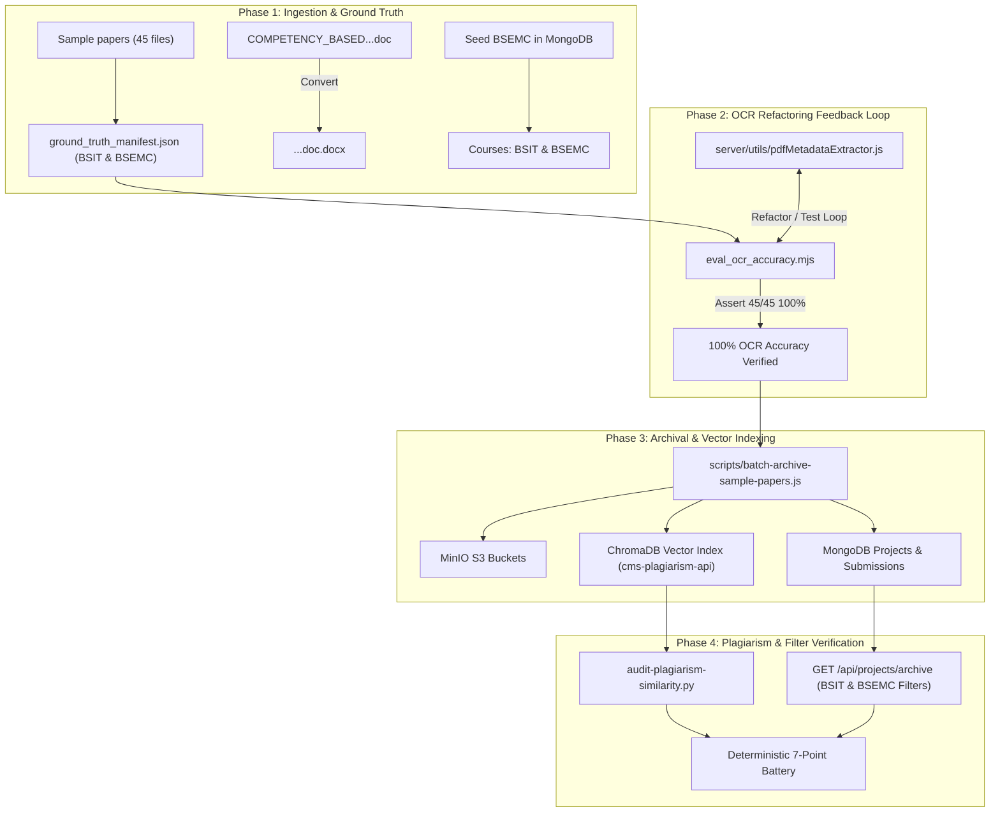

# Sample Capstone Archival, OCR Accuracy & Plagiarism Testing Implementation Plan

> **For agentic workers:** REQUIRED SUB-SKILL: Use superpowers:subagent-driven-development to implement this plan task-by-task. Steps use checkbox (`- [ ]`) syntax for tracking.

**Goal:** Automate ingestion and archival of 45 sample capstone papers, sort them into BSIT and BSEMC courses, refactor the OCR/PDF metadata extraction engine via an automated feedback loop to achieve 100% accuracy, index vector embeddings in ChromaDB, and rigorously test plagiarism detection and archive filtering.

**Architecture:** A manifest-driven feedback loop evaluates and refactors the core PDF metadata extractor until all 45 documents match ground truth with 100% precision. The official CMS-V2 service layer then ingests the papers into S3/MinIO, MongoDB (with proper BSIT/BSEMC course bindings), and ChromaDB (via FastAPI BGE-M3 vector embeddings) for cross-similarity auditing.

**Architecture Diagram:**

**Tech Stack:** Node.js (ESM), Express 5, Mongoose 9, FastAPI, ChromaDB, PyTorch/Sentence-Transformers (`BAAI/bge-m3`), PyMuPDF/pdf-parse/mammoth, MinIO S3 SDK.

**Spec:** `docs/superpowers/specs/2026-09-30-capstone-sample-archival-ocr-plagiarism-design.md`

## Global Constraints
- All 45 sample papers must be sorted into BSIT or BSEMC.
- OCR metadata extraction must achieve 100% accuracy verified against the ground-truth manifest.
- Course filtering in `/api/projects/archive` must return exact matches for `BSIT` and `BSEMC`.
- Plagiarism engine must index all 45 papers in ChromaDB with valid non-zero embeddings.
- Zero unmatched endpoints (`npm run check:endpoints`).
- All 60 agentic validation checks must pass (`npm run validate:agentic`).

---

### Task 1: Dataset Sorting & Ground-Truth Manifest Setup
**Files:**
- Create: `Sample papers/ground_truth_manifest.json`
- Convert: `Sample papers/COMPETENCY_BASED_CURRICULUM_INFORMATION.doc` -> `.docx`
- Test: `scratch/verify_manifest.mjs`

- [ ] **Step 1: Convert legacy `.doc` to modern `.docx` format**
- [ ] **Step 2: Inspect all 45 papers to build ground-truth manifest mapping filename to courseCode, canonicalTitle, canonicalAuthors, canonicalYear, canonicalAbstract, and tags**
- [ ] **Step 3: Run verify_manifest.mjs to assert 45 entries exist with zero missing fields**

### Task 2: BSEMC Course Seeding in MongoDB
**Files:**
- Create: `scripts/seed-bsemc-course.js`
- Test: Node script verifying Course collection in MongoDB

- [ ] **Step 1: Write script to check if BSEMC exists and insert it if not**
- [ ] **Step 2: Execute script in cms-server container**
- [ ] **Step 3: Verify MongoDB returns both BSIT and BSEMC courses**

### Task 3: Refactor OCR & PDF Metadata Extractor (100% Accuracy Feedback Loop)
**Files:**
- Modify: `server/utils/pdfMetadataExtractor.js`
- Create: `scratch/eval_ocr_accuracy.mjs`

- [ ] **Step 1: Write eval_ocr_accuracy.mjs to test extractor against all 45 manifest entries**
- [ ] **Step 2: Run eval_ocr_accuracy.mjs to identify failing patterns (header noise, UNESCO/WHO, multi-line titles)**
- [ ] **Step 3: Refactor `server/utils/pdfMetadataExtractor.js` with noise suppression and heuristic refinement**
- [ ] **Step 4: Re-run eval_ocr_accuracy.mjs iteratively until 45/45 (100%) passes**

### Task 4: Support `courseId` and Tags in Bulk Archival Service
**Files:**
- Modify: `server/modules/projects/project.validation.js`
- Modify: `server/modules/projects/project.service.js`
- Test: `tests/unit/project.service.test.js` or targeted test

- [ ] **Step 1: Update bulkUploadSchema in project.validation.js to accept `courseId`**
- [ ] **Step 2: Update bulkUploadArchive in project.service.js to use provided `courseId` instead of dummy ObjectId**
- [ ] **Step 3: Verify endpoint parity (`npm run check:endpoints`)**

### Task 5: Automated Batch Ingestion of 45 Capstone Papers
**Files:**
- Create: `scripts/batch-archive-sample-papers.js`
- Test: Ingestion log and MongoDB/S3 query

- [ ] **Step 1: Implement batch archiving script using project.service.js bulkUploadArchive with manifest data**
- [ ] **Step 2: Run batch ingestion inside cms-server**
- [ ] **Step 3: Verify 45 projects created in MongoDB with status 'archived' and S3 storage keys**

### Task 6: ChromaDB Plagiarism Vector Indexing & Cross-Similarity Audit
**Files:**
- Create: `scripts/audit-plagiarism-similarity.py`
- Test: Execution output of audit-plagiarism-similarity.py

- [ ] **Step 1: Script document indexing into ChromaDB via cms-plagiarism-api**
- [ ] **Step 2: Run cross-similarity comparison matrix across all 45 papers**
- [ ] **Step 3: Assert semantic clusters (e.g. accident detection, 3D rendering) show high similarity and distinct topics show low baseline**

### Task 7: Archive Search & Filter Verification
**Files:**
- Create: `scratch/verify_archive_filters.mjs`

- [ ] **Step 1: Query `/api/projects/archive?program=BSIT` and assert only BSIT projects returned**
- [ ] **Step 2: Query `/api/projects/archive?program=BSEMC` and assert only BSEMC projects returned**
- [ ] **Step 3: Query keyword/tag search and assert matching projects returned**

### Task 8: Final Quality Gates & PTSS Archival
- [ ] **Step 1: Run `npm run check:endpoints` (UNMATCHED_COUNT == 0)**
- [ ] **Step 2: Run `npm run validate:agentic` (60/60 checks)**
- [ ] **Step 3: Update `chat-starter.json` status to completed and record lessons in `memories/repo/CMS-V2-Technical-Context.md`**
