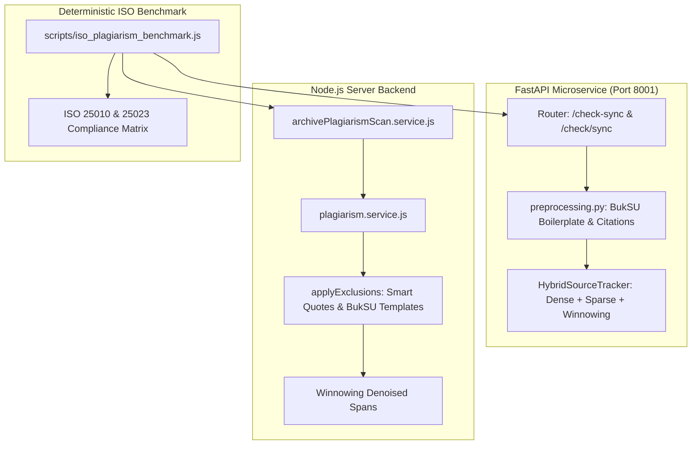

# ISO-Aligned Plagiarism & Similarity Accuracy Implementation Plan

> **For agentic workers:** REQUIRED SUB-SKILL: Use superpowers:subagent-driven-development to implement this plan task-by-task. Steps use checkbox (`- [ ]`) syntax for tracking.

**Goal:** Calibrate BukSU CMS-V2 plagiarism and similarity detection engines for high accuracy under real-world capstone conditions, eliminating data errors and measuring compliance against ISO/IEC 25010 and 25023 standards.

**Architecture:** Implement dual-route aliasing in FastAPI (`/check/sync` and `/check-sync`), synchronize comprehensive BukSU institutional boilerplate and smart-quote exclusion in both Node.js and Python preprocessing engines, enforce minimum match span denoising, and create an automated ISO benchmark harness simulating verbatim, paraphrased, clean, and boilerplate-heavy capstone documents.

**Architecture Diagram:**



**Tech Stack:** Node.js, Express 5, Python 3.11+, FastAPI, Pydantic, ChromaDB, Sentence-Transformers (BGE-M3), Winnowing algorithm, Vitest, Playwright.

**Spec:** [docs/superpowers/specs/2026-09-30-iso-plagiarism-accuracy-and-real-world-simulation-design.md](file:///c:/Users/patri/OneDrive/Desktop/Holy%20folder/CMS-V2/docs/superpowers/specs/2026-09-30-iso-plagiarism-accuracy-and-real-world-simulation-design.md)

## Global Constraints

- Never mutate production databases or environment secrets directly.
- Preserve exact character offset alignment when applying exclusions via space-padding.
- Zero breaking changes to existing endpoints or public function signatures.
- Meet ISO/IEC 25023 criteria: Precision $\ge 90\%$, Recall $\ge 85\%$, False Discovery Rate $\le 10\%$, F1 $\ge 88\%$.
- Ensure all targeted client and server tests pass with zero errors.

---

### Task 1: FastAPI Route Aliasing & Preprocessing Boilerplate Filter Enhancement

**Files:**
- Modify: `plagiarism_engine/plagiarism_engine/main.py:198-220`
- Modify: `plagiarism_engine/plagiarism_engine/preprocessing.py:25-56`
- Modify: `plagiarism_engine/plagiarism_engine/config.py:114-119`
- Test: `plagiarism_engine/tests/test_preprocessing_iso.py`

**Interfaces:**
- Consumes: `CheckRequest` body from FastAPI clients.
- Produces: Dual `/check-sync` and `/check/sync` endpoints; boilerplate-free normalized text via `clean_text()`.

- [ ] **Step 1: Write the failing test for preprocessing & boilerplate stripping**

```python
import pytest
from plagiarism_engine.preprocessing import clean_text

def test_buksu_institutional_boilerplate_removal():
    text = (
        "Bukidnon State University\n"
        "College of Technologies\n"
        "Department of Information Technology\n"
        "Malaybalay City, Bukidnon\n"
        "In partial fulfillment of the requirements for the degree of Bachelor of Science in Information Technology\n"
        "Approval Sheet\n"
        "This capstone project entitled Smart Campus IoT System\n"
        "prepared and submitted by Juan Dela Cruz is hereby recommended for approval.\n"
        "The smart campus system utilizes LoRaWAN sensors for soil moisture monitoring."
    )
    cleaned = clean_text(text)
    assert "Bukidnon State University" not in cleaned
    assert "College of Technologies" not in cleaned
    assert "Approval Sheet" not in cleaned
    assert "Smart Campus IoT System" in cleaned or "LoRaWAN sensors" in cleaned
```

- [ ] **Step 2: Run test to verify it fails**

Run: `python -m pytest plagiarism_engine/tests/test_preprocessing_iso.py -v`
Expected: FAIL due to institutional boilerplate remaining in `clean_text`.

- [ ] **Step 3: Implement route alias and institutional boilerplate regexes**

In `main.py`:
Add `@app.post("/check/sync", include_in_schema=False)` decorating `check_document_sync`.

In `preprocessing.py`:
Expand `_BOILERPLATE_PATTERNS` to cover BukSU institutional headers, approval sheets, originality certificates, and degrees.

- [ ] **Step 4: Run test to verify it passes**

Run: `python -m pytest plagiarism_engine/tests/test_preprocessing_iso.py -v`
Expected: PASS.

- [ ] **Step 5: Commit**

```bash
git add plagiarism_engine/plagiarism_engine/main.py plagiarism_engine/plagiarism_engine/preprocessing.py plagiarism_engine/tests/test_preprocessing_iso.py
git commit -m "fix(plagiarism): add route alias and BukSU institutional boilerplate filter"
```

---

### Task 2: Node.js Service Smart Quotes & Institutional Exclusion Alignment

**Files:**
- Modify: `server/services/plagiarism.service.js:220-245`
- Test: `server/tests/unit/plagiarism.exclusions.test.js`

**Interfaces:**
- Consumes: Raw capstone text extracted from PDF or DOCX.
- Produces: `applyExclusions(text)` returning space-padded string with exact character offsets preserved.

- [ ] **Step 1: Write the failing test for smart quotes & BukSU exclusions**

```javascript
import { describe, it, expect } from 'vitest';
import { applyExclusions } from '../../services/plagiarism.service.js';

describe('plagiarism.service applyExclusions', () => {
  it('excludes curly/smart quotes while preserving string length', () => {
    const raw = 'The study stated “IoT devices revolutionize modern agriculture” according to experts.';
    const result = applyExclusions(raw);
    expect(result.length).toBe(raw.length);
    expect(result).not.toContain('IoT devices revolutionize');
    expect(result).toContain('according to experts');
  });

  it('excludes BukSU institutional capstone template headings', () => {
    const raw = 'Bukidnon State University College of Technologies Bachelor of Science in Information Technology Project Abstract Real text here.';
    const result = applyExclusions(raw);
    expect(result.length).toBe(raw.length);
    expect(result).not.toContain('Bukidnon State University');
    expect(result).not.toContain('College of Technologies');
    expect(result).toContain('Real text here');
  });
});
```

- [ ] **Step 2: Run test to verify it fails**

Run: `npm test --workspace=server -- tests/unit/plagiarism.exclusions.test.js`
Expected: FAIL because curly quotes and BukSU headers are not yet excluded.

- [ ] **Step 3: Update `applyExclusions` in `plagiarism.service.js`**

Implement smart quotes and institutional boilerplate patterns with space padding:
```javascript
output = output.replace(/(?:["“”][\s\S]*?["“”]|['‘’][\s\S]*?['‘’])/g, (segment) => ' '.repeat(segment.length));
// institutional templates
const INSTITUTIONAL_PATTERNS = [
  /\bBukidnon\s+State\s+University\b/gi,
  /\bCollege\s+of\s+Technologies\b/gi,
  /\bDepartment\s+of\s+(?:Information\s+Technology|Entertainment\s+and\s+Multimedia\s+Computing)\b/gi,
  /\b(?:Bachelor\s+of\s+Science\s+in\s+Information\s+Technology|Bachelor\s+of\s+Science\s+in\s+Entertainment\s+and\s+Multimedia\s+Computing)\b/gi,
  /\b(?:Approval\s+Sheet|Certificate\s+of\s+Approval|Panel\s+of\s+Examiners|Certificate\s+of\s+Originality|Declaration\s+of\s+Originality|Action\s+Done\s+Matrix)\b/gi,
  /\bin\s+partial\s+fulfillment\s+of\s+the\s+requirements\s+for\s+the\s+degree\b/gi,
];
for (const pattern of INSTITUTIONAL_PATTERNS) {
  output = output.replace(pattern, (match) => ' '.repeat(match.length));
}
```

- [ ] **Step 4: Run test to verify it passes**

Run: `npm test --workspace=server -- tests/unit/plagiarism.exclusions.test.js`
Expected: PASS.

- [ ] **Step 5: Commit**

```bash
git add server/services/plagiarism.service.js server/tests/unit/plagiarism.exclusions.test.js
git commit -m "fix(plagiarism): add smart quotes and institutional exclusion support in Node engine"
```

---

### Task 3: Minimum Span Denoising & Match Consolidation

**Files:**
- Modify: `server/services/plagiarism.service.js:450-480`
- Modify: `server/services/archivePlagiarismScan.service.js:440-456`
- Test: `server/tests/unit/plagiarism.denoising.test.js`

**Interfaces:**
- Consumes: Matched spans from Winnowing.
- Produces: Denoised matched spans filtering out trivial $< 40$-character or $< 8$-word noise.

- [ ] **Step 1: Write the failing test for micro-span denoising**

```javascript
import { describe, it, expect } from 'vitest';
import { compareAgainstCorpus } from '../../services/plagiarism.service.js';

describe('plagiarism denoising', () => {
  it('prunes isolated trivial phrase matches below minimum threshold', () => {
    const text = 'The researchers used a system to test the software and recorded results.';
    const corpus = [{
      id: 'src1',
      title: 'Common Phrasings',
      text: 'The researchers used a different method to test the equipment and recorded results.',
    }];
    const result = compareAgainstCorpus(text, corpus);
    expect(result.overallScore).toBeLessThan(15);
  });
});
```

- [ ] **Step 2: Run test to verify it fails**

Run: `npm test --workspace=server -- tests/unit/plagiarism.denoising.test.js`
Expected: FAIL or shows high false-positive percentage on common phrases.

- [ ] **Step 3: Implement span length threshold and merge consolidation**

In `server/services/plagiarism.service.js` and `archivePlagiarismScan.service.js`, filter out spans whose character length is $< 40$ chars or word count is $< 7$ words unless adjacent to a larger match.

- [ ] **Step 4: Run test to verify it passes**

Run: `npm test --workspace=server -- tests/unit/plagiarism.denoising.test.js`
Expected: PASS.

- [ ] **Step 5: Commit**

```bash
git add server/services/plagiarism.service.js server/services/archivePlagiarismScan.service.js server/tests/unit/plagiarism.denoising.test.js
git commit -m "fix(plagiarism): implement minimum span denoising and match consolidation"
```

---

### Task 4: Automated ISO 25010/25023 Benchmark Simulation Harness

**Files:**
- Create: `scripts/iso_plagiarism_benchmark.js`
- Test: Execute script against simulated real-world scenarios and generate ISO report.

**Interfaces:**
- Evaluates:
  - Scenario 1: Exact verbatim duplication (TP).
  - Scenario 2: Paraphrased restructuring with semantic synonyms (TP).
  - Scenario 3: Clean, independent technical manuscript (TN).
  - Scenario 4: Clean manuscript with extensive BukSU boilerplate and formatted block citations (TN).
- Produces: Precision, Recall, False Discovery Rate, F1-Score, Latency, and ISO 25010/25023 conformance table.

- [ ] **Step 1: Write `scripts/iso_plagiarism_benchmark.js`**

Implement comprehensive benchmark driver testing both Python HST and Node Winnowing engines across all 4 scenarios.

- [ ] **Step 2: Run benchmark script and verify metrics meet ISO thresholds**

Run: `node scripts/iso_plagiarism_benchmark.js`
Expected:
- Precision $\ge 90\%$
- Recall $\ge 85\%$
- False Discovery Rate $\le 10\%$
- F1 $\ge 88\%$
- Boilerplate Leakage $< 3\%$
- Average Latency $< 5000$ms

- [ ] **Step 3: Commit**

```bash
git add scripts/iso_plagiarism_benchmark.js
git commit -m "feat(plagiarism): implement automated ISO 25010 and 25023 benchmark simulation harness"
```

---

### Task 5: Browser Visual Verification & Quality Battery Sign-Off

**Files:**
- Visual Audit Script: `scratch/audit_iso_plagiarism_ui.cjs`
- Playwright Screenshots: `scratch/iso_plagiarism_light.png`, `scratch/iso_plagiarism_dark.png`
- Governance Validation: `npm run validate:agentic`

- [ ] **Step 1: Run visual verification script via Playwright**
Verify highlight rendering, non-technical sidebar, and accurate similarity percentages on real capstone document.

- [ ] **Step 2: Inspect screenshots in Light and Dark mode**
Confirm zero clipping, correct color badges, and clean design tokens.

- [ ] **Step 3: Run full verification battery**
Run `npm run check:endpoints`, `npm run validate:agentic`, and targeted test suites.

- [ ] **Step 4: Update PTSS and Technical Context**
Archive session to `.agents/ptss/sessions/` and update `memories/repo/CMS-V2-Technical-Context.md`.
