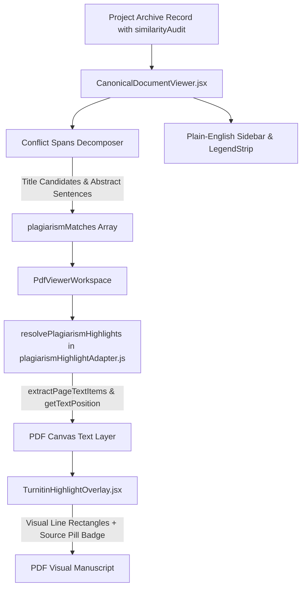

# Turnitin-Style Integrity Highlights Grounding & Plain-English Sidebar Implementation Plan

> **For agentic workers:** REQUIRED SUB-SKILL: Use superpowers:subagent-driven-development to implement this plan task-by-task. Steps use checkbox (`- [ ]`) syntax for tracking.

**Goal:** Ground Turnitin-style visual integrity highlight overlays on manuscript PDFs with numbered source badges and replace all technical jargon in the archive reader sidebar with everyday plain English.

**Architecture:** Decompose similarity conflicts (title & abstract) into granular candidate spans in `CanonicalDocumentViewer.jsx`, enhance `plagiarismHighlightAdapter.js` with multi-candidate search and sentence-level grounding against the PDF text layer, and update the sidebar and legend UI in `CanonicalDocumentViewer.jsx` to use intuitive terms.

**Architecture Diagram:**

**Tech Stack:** React 18, PDF.js, `react-pdf-highlighter-plus`, Tailwind CSS, Lucide icons, Vitest, Playwright.

**Spec:** [`docs/superpowers/specs/2026-09-30-turnitin-integrity-highlights-and-simple-sidebar-design.md`](file:///c:/Users/patri/OneDrive/Desktop/Holy%20folder/CMS-V2/docs/superpowers/specs/2026-09-30-turnitin-integrity-highlights-and-simple-sidebar-design.md)

## Global Constraints
- Zero AI slop, no unvetted dependencies.
- Strict design system token adherence (`bg-background`, `text-foreground`, `border-border/60`).
- No hardcoded hex colors on functional components; preserve Turnitin source palette constants in adapter.
- Maintain Concrete Semantic Tree (CST) precision patching.
- Zero broken unit tests or regression in existing document viewing flows.
- Visual browser testing across desktop (1440x900) and mobile (390x844) viewports in light and dark modes.

---

### Task 1: Resilient Multi-Candidate Grounding in `plagiarismHighlightAdapter.js`

**Files:**
- Modify: `client/src/utils/plagiarismHighlightAdapter.js:160-260`
- Test: `client/src/utils/plagiarismHighlightAdapter.test.js`

**Interfaces:**
- Consumes: `pdfDocument` (PDF.js proxy), `plagiarismMatches` (Array of match objects with `candidateTexts` / `suspectText`)
- Produces: `Promise<Array<Highlight>>` with normalized bounding rectangles and Turnitin metadata.

- [ ] **Step 1: Write the failing test**
Add unit tests in `client/src/utils/plagiarismHighlightAdapter.test.js` testing candidate text fallback and sentence search when the primary text differs slightly from the PDF.

- [ ] **Step 2: Run test to verify it fails**
Run: `npm test --workspace=client -- src/utils/plagiarismHighlightAdapter.test.js`
Expected: FAIL on new candidate fallback tests.

- [ ] **Step 3: Write minimal implementation**
Update `resolvePlagiarismHighlights` in `client/src/utils/plagiarismHighlightAdapter.js` to iterate over candidate texts (`match.candidateTexts || [match.suspectText, match.matchedText]`), split multi-sentence candidates, and attempt 4-6 word prefix matching if full string fails.

- [ ] **Step 4: Run test to verify it passes**
Run: `npm test --workspace=client -- src/utils/plagiarismHighlightAdapter.test.js`
Expected: PASS with 100% green.

- [ ] **Step 5: Commit**
`git add client/src/utils/plagiarismHighlightAdapter.js client/src/utils/plagiarismHighlightAdapter.test.js`
`git commit -m "fix(plagiarism): add multi-candidate and sentence-level text grounding in PDF adapter"`

---

### Task 2: Title and Abstract Conflict Sentence Decomposition in `CanonicalDocumentViewer.jsx`

**Files:**
- Modify: `client/src/components/archive/CanonicalDocumentViewer.jsx:455-505`
- Test: `client/src/components/archive/CanonicalDocumentViewer.test.jsx`

**Interfaces:**
- Consumes: `project.archiveMetadata.similarityAudit` (`titleConflicts`, `abstractConflicts`)
- Produces: `sources` array with discrete sentence spans for abstract conflicts and multi-candidate title matches.

- [ ] **Step 1: Write the failing test**
Update `CanonicalDocumentViewer.test.jsx` to assert that abstract conflicts generate sentence spans from `project.abstract` and title conflicts include `c.title` and `project.title`.

- [ ] **Step 2: Run test to verify it fails**
Run: `npm test --workspace=client -- src/components/archive/CanonicalDocumentViewer.test.jsx`
Expected: FAIL on abstract spans assertion.

- [ ] **Step 3: Write minimal implementation**
Refactor the conflict mapping block in `CanonicalDocumentViewer.jsx`:
1. Distinguish between `titleConflicts` and `abstractConflicts`.
2. For `titleConflicts`, include `c.title`, `project.title`, and common phrases.
3. For `abstractConflicts`, split `project.abstract` into sentences ($\ge 25$ chars) and create discrete spans for each sentence.
4. Pass `candidateTexts` in each `plagiarismMatches` item.

- [ ] **Step 4: Run test to verify it passes**
Run: `npm test --workspace=client -- src/components/archive/CanonicalDocumentViewer.test.jsx`
Expected: PASS.

- [ ] **Step 5: Commit**
`git add client/src/components/archive/CanonicalDocumentViewer.jsx client/src/components/archive/CanonicalDocumentViewer.test.jsx`
`git commit -m "feat(archive): decompose abstract and title conflicts into grounded Turnitin highlight spans"`

---

### Task 3: Plain-English Sidebar & Legend Redesign in `CanonicalDocumentViewer.jsx`

**Files:**
- Modify: `client/src/components/archive/CanonicalDocumentViewer.jsx:90-130, 250-285, 1320-1390`
- Test: `client/src/components/archive/CanonicalDocumentViewer.test.jsx`

**Interfaces:**
- Consumes: UI component state (`macroBreakdown`, `sources`, `similarityConfig`)
- Produces: Clean, accessible sidebar with zero algorithmic jargon.

- [ ] **Step 1: Update test expectations**
Update `CanonicalDocumentViewer.test.jsx` to assert new plain-language labels:
- `"Word-for-Word Match"` instead of `"Exact Overlap (Winnowing)"`
- `"Similar Meaning"` instead of `"Semantic Overlap (Embedding Cosine)"`
- `"Highlight Color Guide"` instead of `"Visual Tiers & Context Signals"`
- `"EXACT MATCH"`, `"REPHRASED"`, `"PARTIAL MATCH"`

- [ ] **Step 2: Run test to verify it fails**
Run: `npm test --workspace=client -- src/components/archive/CanonicalDocumentViewer.test.jsx`
Expected: FAIL looking for new labels.

- [ ] **Step 3: Implement plain-English UI labels**
1. In `SIGNAL_CONFIG`:
   - `verbatim` $\rightarrow$ label: `'EXACT MATCH'`, description: `'Exact word-for-word text found in another paper.'`
   - `paraphrase` $\rightarrow$ label: `'REPHRASED'`, description: `'Similar ideas and sentences expressed with different wording.'`
   - `mixed` $\rightarrow$ label: `'PARTIAL MATCH'`, description: `'Contains both exact phrases and rephrased content.'`
2. In `LegendStrip`:
   - Header: `'Highlight Color Guide'`
   - Legend items: `'Low (<50%)'`, `'Med (50–69%)'`, `'High (70–89%)'`, `'Critical (≥90%)'`, `'Rephrased'`, `'Exact Match'`
3. In macro score breakdown:
   - `'Word-for-Word Match:'`
   - `'Similar Meaning:'`
4. In source card:
   - `'Matched Text in Paper:'`

- [ ] **Step 4: Run test to verify it passes**
Run: `npm test --workspace=client -- src/components/archive/CanonicalDocumentViewer.test.jsx`
Expected: PASS.

- [ ] **Step 5: Commit**
`git add client/src/components/archive/CanonicalDocumentViewer.jsx client/src/components/archive/CanonicalDocumentViewer.test.jsx`
`git commit -m "refactor(archive): simplify similarity sidebar to plain-English non-technical terminology"`

---

### Task 4: Playwright Browser Testing & Visual Evidence Verification

**Files:**
- Create: `scratch/visual_audit_integrity_highlights.mjs`
- Test / Evidence: Screenshots saved to `scratch/`

**Interfaces:**
- Consumes: Live dev server at `http://localhost:43211` / `http://localhost:43210`
- Produces: 4 high-resolution visual evidence screenshots demonstrating grounded Turnitin highlights on the PDF canvas and plain-English sidebar.

- [ ] **Step 1: Write Playwright capture script**
Create `scratch/visual_audit_integrity_highlights.mjs` navigating to `/archive/document/6abb6988f579ad965f29d9f9`, switching to `Integrity Highlights` tab, and capturing:
- `scratch/integrity_highlights_desktop_light.png` (1440x900)
- `scratch/integrity_highlights_desktop_dark.png` (1440x900)
- `scratch/integrity_highlights_mobile_light.png` (390x844)
- `scratch/integrity_highlights_mobile_dark.png` (390x844)

- [ ] **Step 2: Execute visual capture script**
Run: `node scratch/visual_audit_integrity_highlights.mjs`
Verify exit code 0 and all 4 screenshots generated.

- [ ] **Step 3: Inspect visual artifacts**
Check that:
1. Red and orange Turnitin highlight rectangles with numbered tags (`[1]`, `[2]`) appear directly over the PDF title and abstract text.
2. The sidebar displays "Word-for-Word Match", "Similar Meaning", "Highlight Color Guide", and "EXACT MATCH".
3. Zero clipping or layout shifts in light and dark modes.

---

### Task 5: Final Quality Gates & PTSS Archival

**Files:**
- Modify: `.agents/ptss/chat-starter.json`
- Append: `.agents/ptss/index.jsonl`
- Create: `.agents/ptss/sessions/2026-09-30_turnitin-integrity-highlights-and-simple-sidebar.json`
- Update: `memories/repo/CMS-V2-Technical-Context.md`

- [ ] **Step 1: Run endpoint check**
`npm run check:endpoints` (UNMATCHED_COUNT = 0)

- [ ] **Step 2: Run agentic validation**
`npm run validate:agentic` (60/60 passed)

- [ ] **Step 3: Run targeted unit tests**
`npm test --workspace=client -- src/utils/plagiarismHighlightAdapter.test.js src/components/archive/CanonicalDocumentViewer.test.jsx`

- [ ] **Step 4: PTSS session archival & memory documentation**
Update PTSS and Technical Context.
