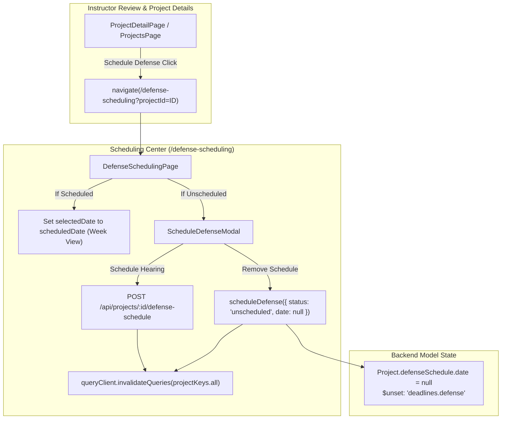

# Wiring Schedule Defense to Scheduling Center, Fixing Deadline Persistence, and Renaming Academic Info Section Implementation Plan

> **For agentic workers:** REQUIRED SUB-SKILL: Use superpowers:subagent-driven-development to implement this plan task-by-task. Steps use checkbox (`- [ ]`) syntax for tracking.

**Goal:** Seamlessly wire the Schedule Defense button on Instructor Review and Project Details to the Scheduling Center, fix persistent overdue defense schedules and deadline clearing, and rename "Section *" to "Year and Section *" in the Academic Info profile section.

**Architecture:**
1. **Frontend Navigation & Deep-Linking:** Update `ProjectDetailPage` and `ProjectsPage` to route the Instructor "Schedule Defense" action directly to `/defense-scheduling?projectId=${projectId}`. Enhance `DefenseSchedulingPage` to parse `projectId` from URL search parameters, navigate the calendar view directly to the project's scheduled week if already scheduled, or automatically open the scheduling modal if unscheduled.
2. **Defensive Schedule & Deadline Deletion:** Add an "Unschedule / Remove Schedule" action in `ScheduleDefenseModal`, fix `TeamCommitteeAssignmentsView` so clearing deadline inputs sends `null` instead of omitting the field, and ensure `projectService.scheduleDefense` unsets `deadlines.defense` and sets `defenseSchedule.status = 'unscheduled'` with `date = null`.
3. **Cache Invalidation:** Invalidate `projectKeys.all` on every defense scheduling, unscheduling, and deadline update so all project detail pages and lists immediately reflect updated state.
4. **Institutional Terminology:** Rename "Section *" to "Year and Section *" in `ProfilePage.jsx` Academic Info card for student profiles.

**Architecture Diagram:**



**Tech Stack:**
- React 18, Vite, Tailwind CSS, Lucide React
- TanStack Query (React Query)
- React Router v6
- Vitest & React Testing Library
- Express 5 & Mongoose 9 ODM

**Spec:** Bounded task approved by user in conversation turn.

## Global Constraints
- Design system tokens strictly adhered to (`bg-background`, `text-foreground`, `border-border/60`).
- No raw hex colors on functional elements.
- Fast-Path Targeted Testing (`npm test --workspace=client -- <test-file>`).
- Playwright visual loop verification before declaring task complete.

---

### Task 1: Academic Info — Rename Section to Year and Section

**Files:**
- Modify: `client/src/pages/profile/ProfilePage.jsx`
- Test: `client/src/pages/profile/ProfilePage.test.jsx`

**Interfaces:**
- UI display text and accessible labels for Academic Info card on student profile.

- [ ] **Step 1: Write the failing test**

```jsx
// client/src/pages/profile/ProfilePage.test.jsx
import React from 'react';
import { describe, it, expect, vi } from 'vitest';
import { render, screen } from '@testing-library/react';
import { MemoryRouter } from 'react-router-dom';
import ProfilePage from './ProfilePage';

vi.mock('@/store/authStore', () => ({
  useAuthStore: () => ({
    user: { _id: 'u1', role: 'student', firstName: 'John', lastName: 'Doe', email: 'john@buksu.edu.ph' },
  }),
}));

vi.mock('@/hooks/useAcademics', () => ({
  useSections: () => ({ data: [{ _id: 's1', name: 'BSIT-4A', code: 'BSIT-4A', academicYear: '2025-2026' }], isLoading: false }),
  useInstructors: () => ({ data: [{ _id: 'i1', firstName: 'Rozanne', lastName: 'Flores' }], isLoading: false }),
}));

describe('ProfilePage Academic Info', () => {
  it('renders "Year and Section *" label and "Select your year and section" placeholder', () => {
    render(
      <MemoryRouter>
        <ProfilePage />
      </MemoryRouter>
    );
    expect(screen.getByText(/Year and Section \*/i)).toBeInTheDocument();
    expect(screen.getByText(/Select your year and section/i)).toBeInTheDocument();
  });
});
```

- [ ] **Step 2: Run test to verify it fails**

Run: `npm test --workspace=client -- src/pages/profile/ProfilePage.test.jsx`
Expected: FAIL with "Unable to find an element with text: /Year and Section \*/i"

- [ ] **Step 3: Write minimal implementation in `ProfilePage.jsx`**

```jsx
// client/src/pages/profile/ProfilePage.jsx
// Change:
// <p className="text-sm text-muted-foreground">Your section and assigned instructor.</p>
// to:
// <p className="text-sm text-muted-foreground">Your year & section and assigned instructor.</p>
//
// Change:
// <Label htmlFor="profile-section">Section *</Label>
// to:
// <Label htmlFor="profile-section">Year and Section *</Label>
//
// Change:
// 'Select your section'
// to:
// 'Select your year and section'
```

- [ ] **Step 4: Run test to verify it passes**

Run: `npm test --workspace=client -- src/pages/profile/ProfilePage.test.jsx`
Expected: PASS

- [ ] **Step 5: Commit**

```bash
git add client/src/pages/profile/ProfilePage.jsx client/src/pages/profile/ProfilePage.test.jsx
git commit -m "fix: rename section to year and section in academic info profile card"
```

---

### Task 2: Persistence Fix for Deadlines & Defense Schedules (Unschedule & Clear Actions)

**Files:**
- Modify: `server/modules/projects/project.service.js:4642-4683`
- Modify: `client/src/components/defense/DefenseScheduleBadge.jsx:36-80`
- Modify: `client/src/components/defense/ScheduleDefenseModal.jsx`
- Modify: `client/src/components/users/TeamCommitteeAssignmentsView.jsx:300-315`
- Test: `client/src/components/defense/DefenseScheduleBadge.test.jsx`
- Test: `client/src/components/defense/ScheduleDefenseModal.test.jsx`

**Interfaces:**
- Consumes: `projectService.scheduleDefense(projectId, { status: 'unscheduled', date: null, time: '' })`
- Produces: Complete removal of scheduled defense date and `deadlines.defense`, hiding overdue badges.

- [ ] **Step 1: Write the failing test for `DefenseScheduleBadge` and `ScheduleDefenseModal`**

```jsx
// In client/src/components/defense/DefenseScheduleBadge.test.jsx
it('returns null when defenseSchedule status is unscheduled', () => {
  const { container } = render(
    <DefenseScheduleBadge defenseSchedule={{ status: 'unscheduled', date: null }} />
  );
  expect(container.firstChild).toBeNull();
});

it('returns null when date is null or empty and status is not pending_scheduling', () => {
  const { container } = render(
    <DefenseScheduleBadge defenseSchedule={{ status: 'scheduled', date: null }} />
  );
  expect(container.firstChild).toBeNull();
});
```

- [ ] **Step 2: Run test to verify failure**

Run: `npm test --workspace=client -- src/components/defense/DefenseScheduleBadge.test.jsx`

- [ ] **Step 3: Update `DefenseScheduleBadge.jsx`, `project.service.js`, and `ScheduleDefenseModal.jsx`**

1. In `DefenseScheduleBadge.jsx`:
```javascript
  if (status === 'none' || status === 'unscheduled') return null;
  if (!rawDate && status !== 'pending_scheduling') return null;
```

2. In `server/modules/projects/project.service.js`:
```javascript
    const isClearingSchedule =
      status === 'unscheduled' ||
      status === 'cancelled' ||
      (date === null && (!time || time === ''));

    const targetStatus = isClearingSchedule ? 'unscheduled' : (status || 'scheduled');
    const scheduledDate = isClearingSchedule ? null : (date ? new Date(date) : null);

    project.defenseSchedule = {
      date: scheduledDate,
      time: isClearingSchedule ? '' : (time || project.defenseSchedule?.time || ''),
      venue: isClearingSchedule ? '' : (venue || project.defenseSchedule?.venue || 'COT Conference Room'),
      round: round || project.defenseSchedule?.round || '1st',
      defenseType: defenseType || project.defenseSchedule?.defenseType || 'proposal',
      clientName: isClearingSchedule ? '' : (clientName || project.defenseSchedule?.clientName || ''),
      scheduledBy: user._id,
      scheduledAt: isClearingSchedule ? null : new Date(),
      status: targetStatus,
    };

    const updateOps = { $set: { defenseSchedule: project.defenseSchedule } };
    if (isClearingSchedule) {
      updateOps.$unset = { 'deadlines.defense': 1 };
    } else if (scheduledDate) {
      updateOps.$set['deadlines.defense'] = scheduledDate;
    }
```

3. In `client/src/components/defense/ScheduleDefenseModal.jsx`:
Add "Remove Schedule" / "Unschedule Defense" button when `project?.defenseSchedule?.date` is present.
Clicking it calls `projectService.scheduleDefense(project._id, { status: 'unscheduled', date: null, time: '' })`, calls `queryClient.invalidateQueries({ queryKey: projectKeys.all })`, triggers `onScheduled?.()`, and closes modal.

4. In `client/src/components/users/TeamCommitteeAssignmentsView.jsx:handleSaveDeadlines`:
Ensure `payload[key] = val || null` so clearing an input string actually transmits `null` to clear the field in MongoDB.

- [ ] **Step 4: Run tests to verify they pass**

Run: `npm test --workspace=client -- src/components/defense/DefenseScheduleBadge.test.jsx`
Expected: PASS

- [ ] **Step 5: Commit**

```bash
git add server/modules/projects/project.service.js client/src/components/defense/DefenseScheduleBadge.jsx client/src/components/defense/ScheduleDefenseModal.jsx client/src/components/users/TeamCommitteeAssignmentsView.jsx
git commit -m "fix: add unschedule capability and fix persistent deadline clearing"
```

---

### Task 3: Wire Schedule Defense Button to Scheduling Center & Deep Link Handling

**Files:**
- Modify: `client/src/pages/projects/ProjectDetailPage.jsx`
- Modify: `client/src/pages/instructor/DefenseSchedulingPage.jsx`
- Test: `client/src/pages/instructor/DefenseSchedulingPage.test.jsx`

**Interfaces:**
- Consumes: `navigate('/defense-scheduling?projectId=' + project._id)`
- Produces: Automatic calendar jump to the project's scheduled date or auto-open of scheduling modal for unscheduled teams.

- [ ] **Step 1: Write test for deep linking in `DefenseSchedulingPage.test.jsx`**

```jsx
// Verify that when DefenseSchedulingPage mounts with ?projectId=proj-123
// where proj-123 is scheduled on 2026-10-15, selectedDate jumps to 2026-10-15
```

- [ ] **Step 2: Run test to verify it fails**

Run: `npm test --workspace=client -- src/pages/instructor/DefenseSchedulingPage.test.jsx`

- [ ] **Step 3: Update `ProjectDetailPage.jsx` and `DefenseSchedulingPage.jsx`**

1. In `ProjectDetailPage.jsx`:
```jsx
// Wire Schedule Defense button directly to Scheduling Center with projectId param
onScheduleDefense={
  isInstructor
    ? () => navigate(`/defense-scheduling?projectId=${project._id}`)
    : undefined
}
```

2. In `DefenseSchedulingPage.jsx`:
```jsx
const [searchParams, setSearchParams] = useSearchParams();
const paramProjectId = searchParams.get('projectId');

useEffect(() => {
  if (!paramProjectId || allProjects.length === 0) return;
  const targetProj = allProjects.find((p) => p._id === paramProjectId);
  if (!targetProj) return;

  if (targetProj.defenseSchedule?.date && targetProj.defenseSchedule?.status === 'scheduled') {
    const schedDate = new Date(targetProj.defenseSchedule.date);
    if (!isNaN(schedDate.getTime())) {
      setSelectedDate(schedDate);
    }
  } else {
    // If not yet scheduled, open the scheduling modal for this project
    handleOpenScheduleModal(targetProj);
  }
}, [paramProjectId, allProjects]);
```

3. Ensure `queryClient.invalidateQueries({ queryKey: projectKeys.all })` is invoked whenever a schedule is set, updated, or unscheduled in `DefenseSchedulingPage.jsx`.

- [ ] **Step 4: Run tests to verify they pass**

Run: `npm test --workspace=client -- src/pages/instructor/DefenseSchedulingPage.test.jsx`
Expected: PASS

- [ ] **Step 5: Commit**

```bash
git add client/src/pages/projects/ProjectDetailPage.jsx client/src/pages/instructor/DefenseSchedulingPage.jsx
git commit -m "feat: wire schedule defense button to scheduling center with deep link handling"
```

---

### Task 4: Visual Feedback Loop & Full Governance Battery

**Files:**
- Execute Playwright visual audit script in `scratch/` across Desktop (1440x900) & Mobile (390x844) in Light & Dark modes.
- Verify zero route regressions (`npm run check:endpoints`).
- Verify agentic governance (`npm run validate:agentic`).

- [ ] **Step 1: Run fast-path client tests**
Run: `npm test --workspace=client -- src/pages/profile/ src/components/defense/ src/pages/instructor/`

- [ ] **Step 2: Run endpoint parity and governance checks**
Run: `npm run check:endpoints && npm run validate:agentic`

- [ ] **Step 3: Run Playwright visual audit**
Execute visual audit in `scratch/verify-scheduling-and-profile.mjs` to capture:
1. `ProfilePage` Academic Info showing "Year and Section *"
2. `ProjectDetailPage` showing "Schedule Defense" button
3. `DefenseSchedulingPage` deep-linking and displaying the schedule
4. Clear schedule interaction eliminating the overdue badge
