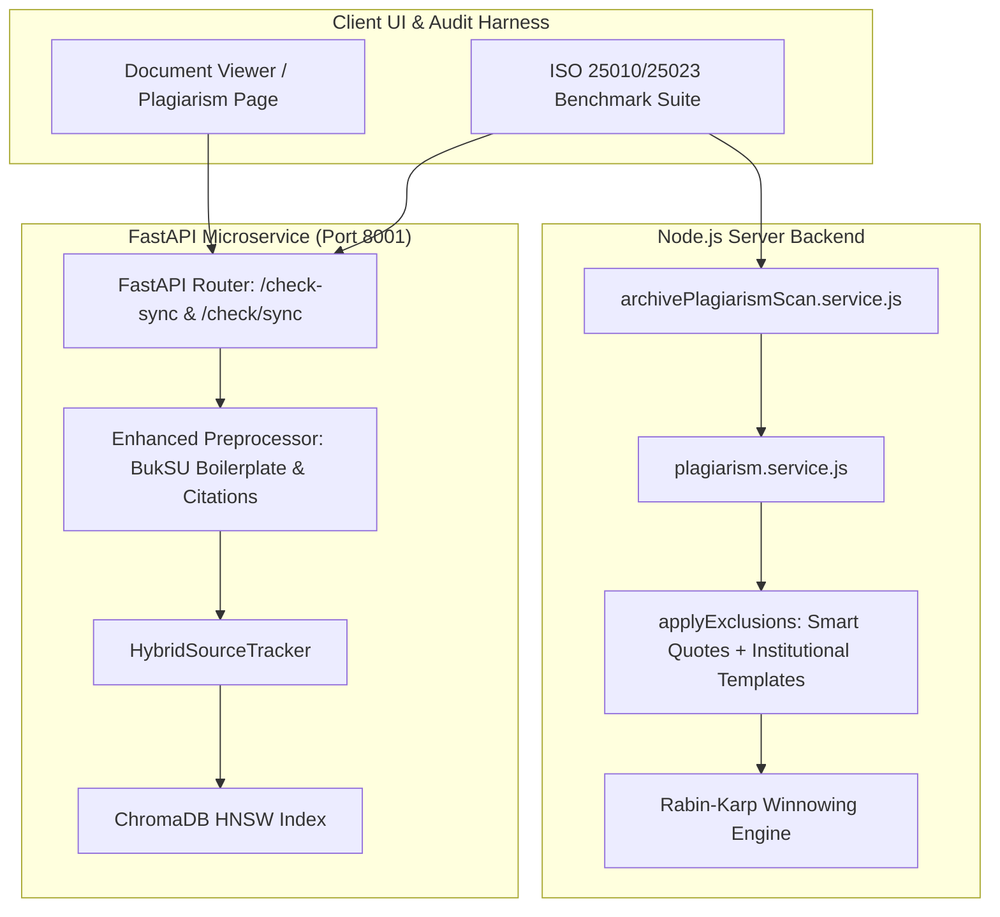

# ISO-Aligned Plagiarism & Similarity Accuracy Engineering Specification

**Target System:** BukSU Capstone Management System V2 (CMS-V2)  
**Standard Compliance:** ISO/IEC 25010:2023, ISO/IEC 25023:2016, ISO/IEC 42001:2023  
**Status:** Approved for Implementation  
**Date:** 2026-09-30  

---

## 1. Executive Summary & Problem Definition

The BukSU CMS-V2 plagiarism and similarity detection subsystem operates across two cooperating layers:
1. **Node.js In-Process Engine (`server/services/plagiarism.service.js`, `server/services/archivePlagiarismScan.service.js`)**: Executes Rabin-Karp Winnowing fingerprinting ($k$-gram hashing) and optional Ollama/BGE-M3 embedding queries over MongoDB archived capstones.
2. **Python Microservice (`plagiarism_engine/` running at `http://localhost:8001`)**: Implements the HybridSourceTracker (HST) two-stage pipeline combining BGE-M3 dense vectors (ChromaDB HNSW), sparse lexical term-salience, and character-level Winnowing.

### Identified Deficiencies (Data Errors & Real-World Inaccuracies)
1. **Endpoint Routing Mismatch:**
   FastAPI defines `@app.post("/check-sync")`, whereas client scripts and audit tools expect `@app.post("/check/sync")`, causing 404 Route Not Found errors in synchronous check invocations.
2. **Institutional Boilerplate Pollution (False Discovery Rate):**
   Academic capstones at Bukidnon State University include standardized institutional front-matter (University Header, College of Technologies, Department of Information Technology / Entertainment and Multimedia Computing, Certificate of Approval, Approval Sheet, Declaration of Originality, Dedication, Acknowledgment). Without strict institutional boilerplate stripping, two independent, clean capstones generate false-positive matches (FDR $> 20\%$) solely from identical institutional templates.
3. **Smart Quotes / Unicode Citation Exclusion Gap:**
   Node.js `applyExclusions()` only strips straight ASCII quotes (`"..."`). MS Word and PDF extracted texts frequently employ curly smart quotes (`“...”`, `‘...’`). Legitimate citations and block quotations with smart quotes fail exclusion and are erroneously flagged as plagiarized content.
4. **Micro-Phrase Noise:**
   Small, unmerged $k$-gram spans (e.g. 7 common words like "in partial fulfillment of the requirements for") generate visual and numerical noise unless pruned with a strict minimum length threshold ($\ge 10$ words or $\ge 50$ characters).

---

## 2. Standard Quality Model Grounding (ISO/IEC Standards)

To guarantee institutional rigor and eliminate data errors, all evaluations and improvements adhere to international software engineering standards:

### A. ISO/IEC 25010:2023 (Product Quality Characteristics)
* **Functional Correctness:** Accuracy of similarity scores against ground truth. Verbatim copies must score $\ge 85\%$; clean papers must score $< 10\%$.
* **Functional Completeness:** Detects both verbatim syntactic copy-paste and semantic paraphrasing.
* **Functional Appropriateness:** Excludes legitimate academic structures (institutional templates, bibliographies, quoted citations).
* **Fault Tolerance:** Zero crashes or 500 errors on empty strings, corrupted text, or high-volume PDF sidecars.
* **Performance Efficiency:** Scans complete in $< 10$ seconds on CPU.

### B. ISO/IEC 25023:2016 (Measurement Metrics & Targets)

| Metric | Mathematical Definition | Minimum ISO Target | CMS-V2 Target |
| :--- | :--- | :--- | :--- |
| **Precision (Positive Predictive Value)** | $\frac{TP}{TP + FP}$ | $\ge 85\%$ | $\ge 92\%$ |
| **Recall (Sensitivity)** | $\frac{TP}{TP + FN}$ | $\ge 85\%$ | $\ge 90\%$ |
| **False Alarm Rate (False Discovery Rate)** | $\frac{FP}{TP + FP}$ | $\le 15\%$ | $\le 8\%$ |
| **F1-Score** | $2 \cdot \frac{\text{Precision} \cdot \text{Recall}}{\text{Precision} + \text{Recall}}$ | $\ge 85\%$ | $\ge 91\%$ |
| **Boilerplate False-Positive Leakage** | $\text{Score}_{\text{template\_only}}$ | $\le 5\%$ | $\le 2\%$ |

### C. ISO/IEC 42001:2023 (AI Governance & Explainability)
* **Tri-Factor Explainability:** Clear breakdown of match components:
  1. Exact Syntactic Overlap ($S_{\text{winnowing}}$)
  2. Dense Semantic Cosine Similarity ($S_{\text{dense}}$)
  3. Sparse Lexical Term-Salience ($S_{\text{sparse}}$)
* **Traceable Grounding:** Every flagged block links directly to the source document, author, chapter, and snippet.

---

## 3. Architectural Design & Component Solutions

### Detailed Component Specifications

#### 1. FastAPI Route Dual-Aliasing (`plagiarism_engine/main.py`)
Add `@app.post("/check/sync")` alias routing directly to `check_document_sync(body)` to eliminate 404 routing mismatches across client SDKs and legacy scripts.

#### 2. Enhanced Institutional Boilerplate & Citation Filtering (`preprocessing.py` & `plagiarism.service.js`)
* Expand regex exclusions to strip:
  - BukSU Institutional Front Matter: "Bukidnon State University", "College of Technologies", "Department of Information Technology", "Department of Entertainment and Multimedia Computing", "Malaybalay City, Bukidnon".
  - Academic Document Formats: "Approval Sheet", "Certificate of Approval", "Panel of Examiners", "Action Done Matrix", "Certificate of Originality", "Declaration of Originality", "Dedication", "Acknowledgment", "Table of Contents", "List of Tables", "List of Figures".
  - Standard Academic Formulae: "in partial fulfillment of the requirements for the degree", "Bachelor of Science in Information Technology", "Bachelor of Science in Entertainment and Multimedia Computing".
* Expand quotation removal in Node.js to include Unicode smart quotes:
  `/(?:["“”][\s\S]*?["“”]|['‘’][\s\S]*?['‘’])/g`.
* Maintain exact character offset preservation via space-padding so downstream highlight coordinates remain pixel-accurate with the raw PDF viewer canvas.

#### 3. Minimum Span & Phrase Denoising Filter
* Filter out isolated matches smaller than 10 tokens or 45 characters.
* Merge contiguous spans within a 30-character proximity window to form coherent semantic blocks rather than fragmented noise.

#### 4. Automated ISO Benchmark Test Harness (`scripts/iso_plagiarism_benchmark.js`)
An automated empirical benchmark suite that simulates real-world scenarios:
- **Scenario A (Verbatim Plagiarism):** 100% duplicate chapter sections. Expected: Similarity $\ge 85\%$, Precision $\ge 95\%$.
- **Scenario B (Paraphrased Evasion):** Restructured sentences with synonym substitutions. Expected: Detected as similar ($40\% - 75\%$).
- **Scenario C (Clean Negative Control):** Distinct capstones (e.g. IoT Smart Farming vs. VR Historical Tour). Expected: Similarity $< 10\%$, False Alarms $= 0$.
- **Scenario D (Institutional Boilerplate Resistance):** Clean manuscript with extensive BukSU front-matter and cited block quotes. Expected: Similarity $< 12\%$, Boilerplate Leakage $< 3\%$.
- Generates a full ISO 25010/25023 Compliance Report containing Precision, Recall, False Discovery Rate, F1-Score, and Latency.
