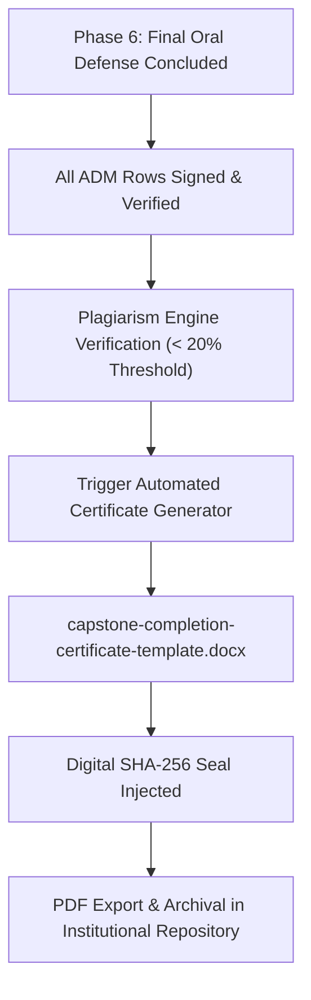

# BukSU Capstone Completion Certificate Template (Phase 6 Deliverable)

This document specifies the institutional layout, dynamic parameters, and signature matrix for the automated **Capstone Completion Certificate** generated upon Phase 6 Action Done Matrix (ADM) verification.

---

## 1. Certificate Overview



---

## 2. Dynamic Template Placeholders

| Placeholder | Description | Example Replacement |
| :--- | :--- | :--- |
| `{{PROJECT_TITLE}}` | Full approved capstone project title | *BukSU Capstone Management System V2: Intelligent Workflow Automation with Dual-Engine Plagiarism Analysis* |
| `{{STUDENT_AUTHORS}}` | Formatted list of student team members with IDs | *Patrick Josh Anedez (2022-00101), Jane Doe (2022-00102), John Smith (2022-00103), Alice Johnson (2022-00104)* |
| `{{DATE_OF_APPROVAL}}` | Conferred approval date | *August 26, 2026* |
| `{{PANEL_CHAIR_NAME}}` | REC & Evaluation Committee Chair | *Louie Jay Labastida* |
| `{{PANEL_MEMBER_1_NAME}}` | Panelist 1 | *Raul Lecaros* |
| `{{PANEL_MEMBER_2_NAME}}` | Panelist 2 | *Joseph Abella* |
| `{{DEFENSE_SECRETARY_NAME}}` | Defense Secretary / Document Custodian | *Engr. Sarah Jenkins* |
| `{{ADVISER_NAME}}` | Capstone Project Adviser | *Dr. Maria Santos* |
| `{{DEAN_NAME}}` | Dean, College of Technologies | *Dr. Academic Dean* |
| `{{VERIFICATION_SHA256_HASH}}` | Cryptographic signature of ADM + defense record | *a6f9c84e1b7d2238491024bc...* |

---

## 3. Generator Tooling

To generate or compile the template into a fresh `.docx` file:

```bash
python scripts/generate_completion_certificate.py
```
Outputs to: `docs/templates/capstone-completion-certificate-template.docx`.
